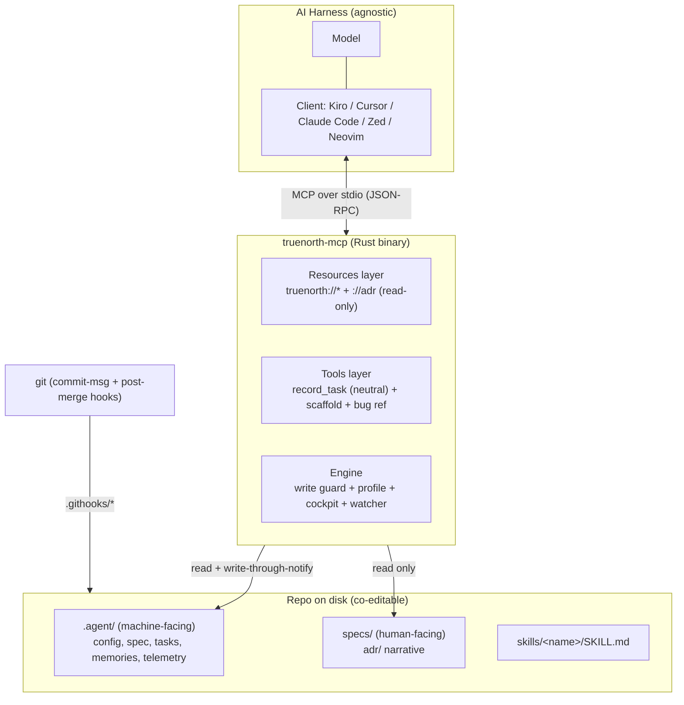
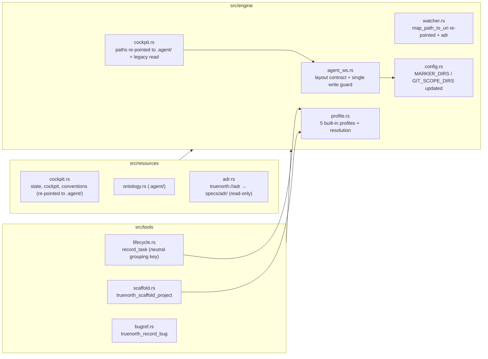

# Design Document: Agent Workspace Profiles

> **Builds on the TrueNorth-MCP refactor.** This design extends the runtime specified in
> `.kiro/specs/truenorth-mcp-refactor/design.md`. It keeps that document's structure, its
> resources/cockpit layer, its sandbox, its backward-compatibility guarantees, and its
> `#[serde(flatten)]` unknown-field preservation. Property numbers here continue past the
> refactor design's P1..P5. Requirement citations point at
> `.kiro/specs/agent-workspace-profiles/requirements.md` (cited as Requirement N or R N.x).

---

## Overview

Agent Workspace Profiles splits the repository into a human-facing layer and a
machine-facing layer. The top-level `specs/` directory becomes human-authored narrative.
A new `.agent/` directory holds the controlled subset the runtime reads, watches, and
writes. The runtime writes only under `.agent/`. The runtime can read human-authored
files under `specs/`, but never mutates a path under `specs/` (Requirement 1).

The feature delivers eight changes on top of the refactor runtime:

1. A language-agnostic `.agent/` layout contract with a single write path that rejects
   any target outside `.agent/` (Requirement 1).
2. Cockpit relocation from `specs/` into `.agent/`, with a backward-compatible read of a
   legacy `specs/` cockpit (Requirement 2).
3. Five built-in methodology profiles as data, with a default and an unknown-profile
   rejection (Requirement 3).
4. A neutral grouping key that replaces the mandatory `epic_id`, with legacy mapping
   (Requirement 4).
5. A greenfield scaffold tool that seeds a new project's `.agent/` tree, root docs, git
   hooks, and `.github/` templates (Requirement 5).
6. Two git hooks: a `commit-msg` validator and a `post-merge` branch sweeper
   (Requirements 6, 7).
7. An external-tracker bug reference stored as a cockpit file under `.agent/`
   (Requirement 8).
8. A read-only `truenorth://adr` resource over `specs/adr/`, plus the ADR migration
   (Requirement 9).

It also finishes the paused skill rewrite and `specs/` cleanup (Requirement 10) and
authors the repo-root `AGENTS.md` against the final layout (Requirement 11). Workflow and
cycle-time metrics stay out of scope (Requirement 12).

### Design stance (per the styleguide)

Behavior is delivered through typed MCP tools and data, not prose. The layout contract,
the profiles, and the bug reference are data. The greenfield scaffold is a schema-backed
tool, not a skill, because it performs a transactional, non-destructive write of a fixed
tree (justified in Section 5). The two git hooks are emitted shell scripts, not runtime
behavior, because git invokes them outside the MCP session. Every change hides behind a
narrow interface: one write path, one profile lookup, one grouping-key struct.

### External references (attribution)

- **Conventional Commits 1.0.0** and **SemVer 2.0.0** drive the `commit-msg` type set and
  the version bump mapping ([conventionalcommits.org](https://www.conventionalcommits.org/en/v1.0.0/)).
- **git hooks** `commit-msg` and `post-merge`, and `core.hooksPath`, are standard git
  features ([git-scm.com hooks docs](https://git-scm.com/docs/githooks)).

_Content was rephrased for compliance with licensing restrictions._

---

## Part I: High-Level Design

## Architecture

This section covers the system context, the component decomposition, and the key
decisions that shape the split.

### System Context



**Boundary decisions:**

- The runtime writes only under `.agent/`. Every write funnels through one guarded path
  (`engine::agent_ws::write_under_agent`) that rejects a target outside `.agent/`
  (Requirement 1.2, 1.3). This is the load-bearing invariant of the feature.
- The runtime reads `specs/adr/` for the ADR resource but never mutates `specs/`
  (Requirement 1.4, 9.4).
- The two git hooks run outside the MCP session. The scaffold emits them; git invokes
  them.

#### Component Diagram



#### Key Architectural Decisions (ADR-style)

##### ADR-6 (DECISION POINT): One guarded write path, not per-call checks

**Context.** Requirement 1.2 and 1.3 require that the runtime never writes outside
`.agent/`. The cockpit writer, the bug-reference writer, and the scaffold all write
files. A per-call check in each writer is easy to forget.

**Decision.** Route every runtime write through a single function
`engine::agent_ws::write_under_agent(repo_root, rel_path, contents)` that canonicalizes
the target, rejects any path that escapes `.agent/`, and then delegates to the existing
atomic `write_atomic` helper in `cockpit.rs`. No other write path exists in library code.

**Rationale.** A narrow interface makes the invariant testable once and impossible to
bypass by omission. It hides the path check behind one obvious surface (deep module,
narrow interface).

**Consequences.** The scaffold's `.githooks/` and `.github/` emission also passes through
this path, because those live outside `.agent/`. The scaffold is the one authorized
exception, so it takes an explicit `allow_repo_root_seed` flag on a separate,
clearly-named path (`write_repo_seed`) that is used only by the scaffold and audited by a
test. The runtime tools never call `write_repo_seed`.

##### ADR-7: Greenfield scaffold is a tool, not a skill

**Context.** Requirement 5 needs an action that seeds a new repository. The styleguide's
"protocol over prose" prefers a schema-backed tool over a markdown skill for load-bearing
behavior.

**Decision.** Ship a `truenorth_scaffold_project` MCP tool. A skill would only instruct a
model to run shell commands, which is prose the model can misread. A tool performs the
transactional, non-destructive write directly and reports skips.

**Rationale.** The scaffold has a bounded input (a profile name), a deterministic output
(a fixed tree), and a strict non-destructive rule (skip existing paths). That is exactly
the shape a typed tool serves best.

**Consequences.** The scaffold writes outside `.agent/` (root docs, `.githooks/`,
`.github/`), so it uses the audited `write_repo_seed` path (ADR-6), not the runtime write
guard.

##### ADR-8: Profiles are fixed data, not a plug-in surface

**Context.** Requirement 3 needs five workflow shapes. Requirement 3.7 and 12.5 forbid
user-defined custom profiles in this spec.

**Decision.** Model the five profiles as a fixed `const` table in `engine::profile`. The
active profile is a single name read from `.agent/` config at startup. No registration
API, no dynamic loading.

**Rationale.** Fixed data keeps the interface narrow and the behavior fully known. Custom
profiles are a future extension outside this spec.

---

## Part II: Low-Level Design

## Components and Interfaces

This part specifies each component and its interface. Section 1 defines the `.agent/`
layout contract and the single write guard. Section 2 covers the cockpit relocation and
the legacy read. Section 3 defines the methodology profiles. Section 4 defines the neutral
grouping key. Section 5 defines the scaffold tool. Sections 6 and 7 define the two git
hooks. Section 8 defines the ADR resource. The subsections below hold the interface
signatures, the schemas, and the emitted files for each component.

### §1. The `.agent/` Layout Contract (Requirement 1)

The layout is language-agnostic data. The contract itself is a checked-in file
`.agent/layout.yml` that lists the required areas and files. Any reader in any language
can parse it. The runtime reading the contract is Rust (Requirement 1.11).

#### §1.1. Concrete tree

```text
.agent/                          # the agent workspace (Requirement 1.1)
├── layout.yml                   # the layout contract, language-agnostic data (R1.11)
├── profile.yml                  # active methodology profile name (R3.4)
├── config/                      # (R1.5)
│   ├── rules.yml                # token caps, human-approval gates, protected paths
│   ├── context-map.yaml
│   ├── context-gates.yml
│   └── lint-standards.md
├── spec/                        # (R1.6)
│   ├── requirements.md
│   ├── architecture.md
│   ├── definition-of-ready.md
│   └── definition-of-done.md
├── tasks/                       # (R1.7)
│   ├── state.yml                # cockpit state + TDD loop (relocated state.yaml, R2.1)
│   ├── active-feature.yaml
│   ├── backlog.yml
│   ├── release-plan.yml         # relocated release-plan.yaml (R2.2)
│   └── bugs.yml                 # external-tracker bug references (R8.1)
├── ontology.yml                 # relocated ontology.yaml (R2.3)
├── product/                     # relocated product concept (R2.12, R10.9)
│   ├── scope.md
│   └── vision.md
├── memories/                    # (R1.8)
│   ├── lessons.md
│   └── glossary.md
└── telemetry/                   # (R1.9) — excluded from agent reads (R1.10)
    └── runs.yml                 # agent cost audit
```

| Area/file                                        | Owner           | Purpose                                              |
| ------------------------------------------------ | --------------- | ---------------------------------------------------- |
| `layout.yml`                                     | human-seeded    | The contract the runtime validates on read (R1.12).  |
| `profile.yml`                                    | human-seeded    | The declared methodology profile name (R3.4).        |
| `config/*`                                       | human-seeded    | Caps, gates, protected paths, lint standards (R1.5). |
| `spec/*`                                         | human-seeded    | Feature narrative and DoR/DoD (R1.6).                |
| `tasks/state.yml`                                | runtime-written | Cockpit state, phase, TDD step (R2.1).               |
| `tasks/release-plan.yml`                         | runtime-written | Recorded tasks and release plan (R2.2).              |
| `tasks/bugs.yml`                                 | runtime-written | Bug references (R8.1).                               |
| `tasks/backlog.yml`, `tasks/active-feature.yaml` | mixed           | Human-seeded, runtime-updatable.                     |
| `ontology.yml`                                   | runtime-written | Domain ontology (R2.3, created on read R2.4).        |
| `product/*`                                      | human-seeded    | Product scope and vision (R2.12).                    |
| `memories/*`                                     | mixed           | Lessons and glossary.                                |
| `telemetry/runs.yml`                             | runtime-written | Cost audit, excluded from agent reads (R1.9, R1.10). |

#### §1.2. The single write guard (Requirement 1.2, 1.3)

```rust
// src/engine/agent_ws.rs

/// The agent workspace directory name (Requirement 1.1).
pub const AGENT_DIR: &str = ".agent";

/// The telemetry area, excluded from agent reads (Requirement 1.9).
pub const TELEMETRY_AREA: &str = "telemetry";

#[derive(Debug, Error)]
pub enum WriteGuardError {
    /// The target escapes `.agent/` (Requirement 1.3).
    #[error(
        "refused to write `{target}`: the runtime writes only under `.agent/`. \
         Move the write target under `.agent/`."
    )]
    OutsideAgent { target: String },
}

/// Write `contents` to `rel_path` under `.agent/`, rejecting any escaping path.
///
/// This is the ONLY write path in runtime library code (ADR-6). It normalizes the joined
/// path and confirms it stays under `repo_root/.agent/`. On rejection it writes nothing,
/// so every target is left unchanged (Requirement 1.3).
pub fn write_under_agent(
    repo_root: &Path,
    rel_path: &Path,
    contents: &str,
) -> Result<(), WriteGuardError>;

/// Report whether a read target is excluded (the telemetry area, Requirement 1.10).
pub fn is_excluded_read(rel_path: &Path) -> bool;
```

The normalization rejects `..` traversal and absolute paths that leave `.agent/`. The
guard delegates the byte write to the existing `write_atomic` helper in
`engine::cockpit` (grounded at `truenorth-mcp/src/engine/cockpit.rs`, `write_atomic`), so
the atomic-rename behavior is unchanged.

#### §1.3. Contract validation on read (Requirement 1.12)

`agent_ws::read_layout(repo_root)` parses `.agent/layout.yml`, then confirms every area
and file named in R1.5 through R1.9 is present. If any is absent, it returns an error that
names the absent path and states the expected layout, and the runtime retains the last
valid contract state in memory (mirroring the `ResourceCache` last-good pattern at
`truenorth-mcp/src/resources/mod.rs`).

#### §1.4. Version control (Requirement 1.13)

The `.gitignore` today ignores `.agent` and `.agents` (grounded at
`.gitignore` lines 35 to 36). The execution phase removes both entries so the `.agent/`
tree tracks under version control.

### §2. Cockpit Relocation (Requirement 2)

#### §2.1. Re-pointed backing paths

`ResourceDoc::backing_path` (grounded at `truenorth-mcp/src/resources/mod.rs`) resolves
each cockpit resource under `.agent/` instead of `specs/`:

| Resource                  | Old backing path          | New backing path                   | Req |
| ------------------------- | ------------------------- | ---------------------------------- | --- |
| `truenorth://state`       | `specs/state.yaml`        | `.agent/tasks/state.yml`           | 2.1 |
| `truenorth://cockpit`     | `specs/release-plan.yaml` | `.agent/tasks/release-plan.yml`    | 2.2 |
| `truenorth://ontology`    | `specs/ontology.yaml`     | `.agent/ontology.yml`              | 2.3 |
| `truenorth://conventions` | `CONVENTIONS.md` (root)   | `CONVENTIONS.md` (root, unchanged) | —   |

`engine::cockpit::state_path` and `release_plan_path` (grounded at
`truenorth-mcp/src/engine/cockpit.rs`) re-point to the same `.agent/tasks/` paths.
`display_backing` in `resources/mod.rs` updates its message strings to match.

When `truenorth://ontology` is read and the backing file is absent, the runtime creates
`.agent/ontology.yml` through the write guard (Requirement 2.4). A create failure returns
a resource read error naming the ontology path and the cause, leaves existing `.agent/`
files unchanged, and retains the last good ontology content, mirroring refactor
Requirement 5.7 (Requirement 2.5).

#### §2.2. Watcher re-pointing (Requirement 2.6, 2.12)

`engine::watcher::map_path_to_uri` (grounded at `truenorth-mcp/src/engine/watcher.rs`)
re-points its suffix matches:

```rust
pub fn map_path_to_uri(path: &Path) -> Option<ResourceUri> {
    let text = path.to_string_lossy().replace('\\', "/");
    if text.ends_with(".agent/tasks/state.yml") {
        return Some(ResourceUri::State);
    }
    if text.ends_with(".agent/ontology.yml") {
        return Some(ResourceUri::Ontology);
    }
    // Release plan or the relocated product path (R2.6, R2.12).
    if text.ends_with(".agent/tasks/release-plan.yml") || text.contains(".agent/product/") {
        return Some(ResourceUri::Cockpit);
    }
    if text.ends_with("CONVENTIONS.md") || text.ends_with("conventions.md") {
        return Some(ResourceUri::Conventions);
    }
    // ADR resource (Requirement 9.3).
    if text.contains("specs/adr/") {
        return Some(ResourceUri::Adr);
    }
    None
}
```

The watcher no longer watches `specs/product/`; the product path is `.agent/product/`
(Requirement 2.12). `specs/adr/` is added (Section 8).

#### §2.3. Marker and git-scope directories (Requirement 2.7, 2.8)

`config::MARKER_DIRS` and `config::GIT_SCOPE_DIRS` (grounded at
`truenorth-mcp/src/config.rs`, currently `["skills", "specs"]`) become:

```rust
const MARKER_DIRS: [&str; 3] = [".agent", "specs", "skills"];
pub const GIT_SCOPE_DIRS: [&str; 3] = [".agent", "specs", "skills"];
```

`specs/` stays in git scope because the runtime reads ADR content there (Requirement 2.8).
The valid-root check in `config::is_valid_repo_root` now requires all three markers.

#### §2.4. Legacy cockpit read (Requirement 2.9, 2.10, 2.11, 2.13)

When a backing file is absent under `.agent/` and a legacy file is present under `specs/`,
`engine::cockpit::read_state` and `read_release_plan` fall back to the legacy path,
parse it, and map its content onto the `.agent/` model. Because the models are map-backed
with a `#[serde(flatten)]` catch-all (refactor Requirement 9), every unknown field keeps
its original key and value, and a `bigpowers_version` key keeps its original value
(Requirement 2.11, 2.13). A malformed legacy file returns a resource read error naming the
file and the parse cause, leaves `.agent/` files unchanged, and retains the last good
content (Requirement 2.10, mirroring refactor Requirement 2.12). A subsequent runtime
write goes to `.agent/` only; the legacy `specs/` file is never mutated (Requirement 1.4).

### §3. Methodology Profiles (Requirement 3)

#### §3.1. Profile schema

```rust
// src/engine/profile.rs

/// The grouping vocabulary a profile uses (Requirement 3.3).
#[derive(Debug, Clone, Copy, PartialEq, Eq, Serialize, Deserialize, JsonSchema)]
#[serde(rename_all = "kebab-case")]
pub enum GroupingVocab { Epic, Sprint, Milestone, Ticket, None }

/// Whether the profile requires a grouping key (Requirement 3.3).
#[derive(Debug, Clone, Copy, PartialEq, Eq)]
pub enum GroupingRule { Required, Optional }

/// A built-in methodology profile as data (Requirement 3.3).
#[derive(Debug, Clone, Copy, PartialEq, Eq)]
pub struct Profile {
    /// The methodology name, one of the five built-ins.
    pub name: &'static str,
    /// The grouping vocabulary, exactly one label.
    pub vocab: GroupingVocab,
    /// Whether grouping is required or optional.
    pub rule: GroupingRule,
    /// The starter file set seeded under `.agent/` for this profile.
    pub starter_files: &'static [&'static str],
    /// The branch-name pattern the post-merge sweep matches (Requirement 7.7).
    pub branch_pattern: &'static str,
    /// Whether the commit-msg hook requires an id reference (Requirement 6.6).
    pub require_issue_id: bool,
}
```

#### §3.2. The five built-ins (Requirement 3.1)

```rust
pub const EPIC_BASED: Profile = Profile {
    name: "epic-based", vocab: GroupingVocab::Epic, rule: GroupingRule::Required,
    starter_files: &["tasks/release-plan.yml", "tasks/backlog.yml"],
    branch_pattern: r"^(feat|fix)/e[0-9]+", require_issue_id: true,
};
pub const ISSUE_PER_TASK: Profile = Profile {   // the default (Requirement 3.2)
    name: "issue-per-task", vocab: GroupingVocab::Ticket, rule: GroupingRule::Optional,
    starter_files: &["tasks/backlog.yml"],
    branch_pattern: r"^(feat|fix|chore)/", require_issue_id: true,
};
pub const KANBAN: Profile = Profile {
    name: "kanban", vocab: GroupingVocab::None, rule: GroupingRule::Optional,
    starter_files: &["tasks/backlog.yml"],
    branch_pattern: r"^(feat|fix|chore)/", require_issue_id: false,
};
pub const MILESTONE_BASED: Profile = Profile {
    name: "milestone-based", vocab: GroupingVocab::Milestone, rule: GroupingRule::Required,
    starter_files: &["tasks/release-plan.yml"],
    branch_pattern: r"^(feat|fix)/m[0-9]+", require_issue_id: true,
};
pub const GENERIC: Profile = Profile {
    name: "generic", vocab: GroupingVocab::None, rule: GroupingRule::Optional,
    starter_files: &["tasks/backlog.yml"],
    branch_pattern: r"^(feat|fix|chore)/", require_issue_id: false,
};

pub const ALL_PROFILES: [Profile; 5] =
    [EPIC_BASED, ISSUE_PER_TASK, KANBAN, MILESTONE_BASED, GENERIC];
```

#### §3.3. Resolution (Requirement 3.4, 3.5, 3.6)

```rust
/// Resolve the active profile from `.agent/profile.yml`.
///
/// Absent config resolves to `ISSUE_PER_TASK` (Requirement 3.5). An unknown name returns
/// an error naming the unknown value and the five valid names, and retains no partial
/// profile state (Requirement 3.6).
pub fn resolve_active(repo_root: &Path) -> Result<Profile, ProfileError>;

/// Look up a profile by name, or `None` when unknown.
pub fn by_name(name: &str) -> Option<Profile> {
    ALL_PROFILES.into_iter().find(|p| p.name == name)
}
```

A request to define a custom profile is rejected: there is no code path to register one
(Requirement 3.7).

### §4. Neutral Grouping Key (Requirement 4)

#### §4.1. New `RecordTaskArgs`

The `epic_id` field of `RecordTaskArgs` (grounded at
`truenorth-mcp/src/tools/lifecycle.rs`) is replaced by a neutral grouping key, keeping the
strict-schema style:

```rust
#[derive(Debug, Deserialize, schemars::JsonSchema)]
pub struct RecordTaskArgs {
    /// Optional grouping key. Its presence rule depends on the active profile (R4.2, R4.3).
    #[serde(default)]
    pub group_id: Option<String>,
    /// Optional group kind, one of epic, sprint, milestone, ticket (R4.1, R4.5).
    #[serde(default)]
    pub group_kind: Option<String>,
    /// Legacy field. When present, maps to group_kind=epic (R4.7).
    #[serde(default)]
    pub epic_id: Option<String>,
    /// The task name (1 to 200 chars).
    pub task_name: String,
    /// The shell command that proves the task done (1 to 1000 chars).
    pub verify_command: String,
}
```

```json
{
  "type": "object",
  "required": ["task_name", "verify_command"],
  "properties": {
    "group_id": { "type": "string", "minLength": 1, "maxLength": 200 },
    "group_kind": { "enum": ["epic", "sprint", "milestone", "ticket"] },
    "epic_id": { "type": "string", "description": "Legacy; maps to group_kind=epic" },
    "task_name": { "type": "string", "minLength": 1, "maxLength": 200 },
    "verify_command": { "type": "string", "minLength": 1, "maxLength": 1000 }
  }
}
```

#### §4.2. Validation order (Requirement 4.2 to 4.8)

The tool validates before any mutation (preserving the pre-call state on every reject,
consistent with the grounded lifecycle pattern):

1. Map legacy `epic_id` to `group_kind = epic` and `group_id = epic_id` when `epic_id` is
   present and `group_id`/`group_kind` are absent (Requirement 4.7). `check_epic_id` and
   `epic_id_re` (grounded at `lifecycle.rs`) move into this legacy mapping.
2. Resolve the active profile.
3. When the profile marks grouping `Required` and no `group_id` is present, reject with an
   error naming the missing grouping key (Requirement 4.3). When `Optional`, accept the
   omission (Requirement 4.2).
4. When `group_id` is present and empty or longer than 200 chars, reject naming the
   invalid value and its bound (Requirement 4.4).
5. When `group_kind` is outside {epic, sprint, milestone, ticket}, reject naming the value
   and the allowed set (Requirement 4.5).
6. When `group_kind` is present but absent from the active profile vocabulary, reject
   naming the mismatch and the profile vocabulary (Requirement 4.6).

`engine::cockpit::apply_task` writes `group_id` and `group_kind` into the task entry
instead of `epic_id`, preserving every other field (Requirement 4.9, via the map-backed
model). When a cockpit file carries a legacy `active_epic` field, the read maps it onto
the neutral grouping model and preserves the original `active_epic` value (Requirement
4.8), through the `#[serde(flatten)]` catch-all.

### §5. Greenfield Scaffold Tool (Requirement 5)

A new tool `truenorth_scaffold_project` lives at `src/tools/scaffold.rs` and registers in
`src/tools/mod.rs` alongside the existing modules (grounded at
`truenorth-mcp/src/tools/mod.rs`).

```rust
#[derive(Debug, Deserialize, schemars::JsonSchema)]
pub struct ScaffoldArgs {
    /// The methodology profile name (1 to 64 chars). Absent uses issue-per-task (R5.1).
    #[serde(default)]
    pub profile: Option<String>,
}
```

Behavior:

1. Resolve the profile. Absent uses `issue-per-task` (Requirement 5.1). An unknown name
   makes no file change and returns an error naming the value and the known names
   (Requirement 5.2).
2. Emit the `.agent/` tree and the cockpit seed files for the profile's `starter_files`
   (Requirement 5.3). This is language-agnostic: no `Cargo.toml`, no `package.json`, no
   source tree (Requirement 5.4).
3. Emit root `AGENTS.md` and `CONVENTIONS.md`, wired to `.agent/` and templated per
   profile, never wired to `specs/` (Requirement 5.5).
4. Emit `.githooks/commit-msg` and `.githooks/post-merge`, templated per profile
   (Requirement 5.6, Sections 6 and 7).
5. Print `git config core.hooksPath .githooks` to standard output, and do not run it
   (Requirement 5.7).
6. Emit `.github/commit-template.md` and `.github/pull-request-template.md` as neutral,
   profile-identical templates that state the atomic-and-conventional-commit rule
   (Requirement 5.8).
7. Emit `.github/ISSUE_TEMPLATE/` fresh: a bug form aligned to the bug reference, a
   feature form, and a `config.yml` with placeholder contact links (Requirement 5.9). The
   forms carry generic structure only, with no copied domain content and no hardcoded URLs
   (Requirement 5.10). When the profile vocabulary is epic or milestone, the forms include
   a grouping field; when the profile is kanban or generic, the forms omit the issue-id
   field the matching hook does not enforce (Requirement 5.11).
8. Non-destructive: an existing target path or an existing `.agent/` tree is left
   unchanged and a skip message names the skipped path (Requirement 5.12).

The scaffold writes outside `.agent/`, so it uses the audited `write_repo_seed` path
(ADR-6, ADR-7), not `write_under_agent`.

### §6. Commit-Message Hook (Requirement 6)

The scaffold emits `.githooks/commit-msg` (the `commit-msg` stage, not `pre-commit`,
Requirement 6.1). Representative content, profile-templated at the marked lines:

```sh
#!/bin/sh
# commit-msg hook. git passes the message file as $1 (Requirement 6.2).
msg_file="$1"
subject=$(head -n1 "$msg_file")

# Merge or revert messages pass unchanged (Requirement 6.10).
case "$subject" in
  "Merge "*|"Revert "*|"fixup! "*|"squash! "*) exit 0 ;;
esac

# Conventional Commits type set (Requirement 6.3, 6.4).
types='feat|fix|docs|style|refactor|perf|test|build|ci|chore|revert'
if ! printf '%s' "$subject" | grep -Eq "^($types)(\([a-z0-9._-]+\))?!?: .+"; then
  echo "commit-msg: subject must be 'type(scope): description'." >&2
  echo "  allowed types: $types" >&2
  exit 1
fi

# Profile-driven id reference (Requirement 6.6, 6.7, 6.8). REQUIRE_ISSUE_ID is templated
# to 'yes' for epic-based, issue-per-task, milestone-based; 'no' for kanban, generic.
REQUIRE_ISSUE_ID="__PROFILE_REQUIRE_ISSUE_ID__"
if [ "$REQUIRE_ISSUE_ID" = "yes" ]; then
  if ! grep -Eq '(#[0-9]+|[A-Z]+-[0-9]+)' "$msg_file"; then
    echo "commit-msg: an issue or ticket id reference is required (e.g. #12 or ABC-12)." >&2
    exit 1
  fi
fi
exit 0
```

Exit-code semantics: exit 0 accepts (Requirement 6.9), non-zero rejects with the stated
error (Requirement 6.4, 6.5, 6.7). For kanban and generic, `REQUIRE_ISSUE_ID` is `no`, so
a message with no id passes with exit 0 (Requirement 6.8).

### §7. Post-Merge Branch Sweep (Requirement 7)

The scaffold emits `.githooks/post-merge` (the `post-merge` stage, Requirement 7.1).
Representative content, profile-templated at the branch pattern:

```sh
#!/bin/sh
# post-merge sweep. Deletes only local topic branches provably present on the trunk.
TRUNK="main"
BRANCH_PATTERN="__PROFILE_BRANCH_PATTERN__"   # from Profile.branch_pattern (Requirement 7.7)

current=$(git symbolic-ref --quiet --short HEAD 2>/dev/null)
# Detached HEAD or unknown branch: exit 0, delete nothing (Requirement 7.3).
[ -z "$current" ] && exit 0
# Sweep only while on the trunk (Requirement 7.2).
[ "$current" != "$TRUNK" ] && exit 0

git for-each-ref --format='%(refname:short)' refs/heads | while read -r b; do
  # Never the current branch or the trunk (Requirement 7.6).
  [ "$b" = "$current" ] && continue
  [ "$b" = "$TRUNK" ] && continue
  # Match the profile branch pattern (Requirement 7.7).
  printf '%s' "$b" | grep -Eq "$BRANCH_PATTERN" || continue
  # Provably present: ancestor of trunk OR empty diff trunk..branch (Requirement 7.4).
  if git merge-base --is-ancestor "$b" "$TRUNK" 2>/dev/null \
     || [ -z "$(git diff "$TRUNK".."$b")" ]; then
    git branch -D "$b"          # delete only the provably-merged branch (Requirement 7.5)
  fi
  # Otherwise retain the branch (Requirement 7.8).
done
exit 0
```

### §8. ADR Resource (Requirement 9)

A new read-only resource `truenorth://adr` resolves `specs/adr/` (Requirement 9.1, 9.2),
using the same pattern as `truenorth://conventions` resolving the root `CONVENTIONS.md`.

`ResourceDoc` (grounded at `truenorth-mcp/src/resources/mod.rs`) gains an `Adr` variant.
`ALL_RESOURCES` grows to five. `backing_path` resolves `repo_root/specs/adr`.
`read_current` reads the directory's ADR files. A new `src/resources/adr.rs` holds the
directory read and concatenation.

Read behaviors:

- Absent `specs/adr/`: return a resource read error naming the missing directory, and
  keep serving other resources (Requirement 9.5, mirroring `ResourceReadError::NotFound`).
- Parse failure of an ADR file: return a resource read error naming the file and the
  failure, retain the last successfully parsed content in the `ResourceCache`, and keep
  serving other resources (Requirement 9.6).
- Write attempt: the resource is read-only, so there is no write path. A write through the
  resource returns an error identifying the read-only resource, and every file under
  `specs/adr/` stays in its pre-attempt state (Requirement 9.4). The write guard (§1.2)
  also rejects any target under `specs/`, so the invariant holds by two layers.

Change notifications: `map_path_to_uri` returns `ResourceUri::Adr` for a change under
`specs/adr/` (§2.2), so the watcher emits `notifications/resources/updated` for
`truenorth://adr` within 1 second of the change (Requirement 9.3), reusing the debounce
loop grounded in `watcher.rs`.

ADR migration plan (Requirement 9.7, 9.8, 9.9):

- Migrate the still-valid bigpowers ADRs into `specs/adr/`: 0001 verb-noun-naming, 0003
  prescriptive-core-loop, 0004 context-isolation, 0005 hard-gate-mandate, 0006
  model-routing (Requirement 9.7).
- Mark ADR 0002 local-first-specs and ADR 0007 agents-md-spine superseded, each with a
  pointer to the replacing decision (Requirement 9.8).
- Add new ADRs for this spec's decisions: the `.agent`-versus-`specs` split, methodology
  profiles, tracker-owns-bugs, and cockpit relocation (Requirement 9.9).

### §9. External-Tracker Bug References (Requirement 8)

A new tool `truenorth_record_bug` lives at `src/tools/bugref.rs`. It writes a lean bug
reference into the cockpit file `.agent/tasks/bugs.yml` through `write_under_agent`
(Requirement 8.1). The external tracker is the source of truth; the runtime stores no bug
narrative directory and no tracker credential, makes no network request, and integrates no
tracker API (Requirement 8.2, 8.4).

```rust
#[derive(Debug, Deserialize, schemars::JsonSchema)]
pub struct RecordBugArgs {
    /// The bug id, a non-empty string of 1 to 200 chars (Requirement 8.6).
    pub id: String,
    /// The external tracker link, an absolute URL (Requirement 8.6).
    pub external_link: String,
    /// The bug status (Requirement 8.6).
    pub status: BugStatus,
    /// The linked task or group id; must reference an existing id (Requirement 8.6).
    pub linked_ref: String,
    /// Optional caller-supplied tags, stored as given (Requirement 8.3).
    #[serde(default)]
    pub tags: Vec<String>,
}

#[derive(Debug, Deserialize, Serialize, JsonSchema)]
#[serde(rename_all = "kebab-case")]
pub enum BugStatus { Open, Triaged, InProgress, Resolved, Closed }
```

Validation before any write (Requirement 8.6, 8.7): id length 1 to 200; `external_link`
parses as an absolute URL; `status` is one of the enum; `linked_ref` resolves to an
existing task or group id in `.agent/tasks/`. A missing or invalid field returns an error
naming the offending field and its expected shape, and leaves `.agent/tasks/bugs.yml` in
its pre-invocation state.

The execution phase removes `specs/bugs/` and every `.okf.md` sidecar, and does not carry
the `.okf` sidecar format into TrueNorth (Requirement 8.5). This is part of the cleanup in
Section 10.

## Data Models

The runtime data models are YAML files under `.agent/`, typed via `serde` in
`engine::spec`, all with the `#[serde(flatten)]` catch-all so unknown fields survive
(refactor Requirement 9). Three model groups matter here:

1. **`.agent/tasks/state.yml` + `release-plan.yml`**: the relocated cockpit shapes.
   `state.yml` keeps `active_epic`, `handoff.*`, `phase`, `tdd.step`, and preserves
   `bigpowers_version` and unknown fields. `release-plan.yml` task entries now carry
   `group_id` and `group_kind` in place of `epic_id`, with legacy `epic_id`/`active_epic`
   mapped and preserved (§4).
2. **`.agent/tasks/bugs.yml`**: a sequence of bug references, each `{id, external_link,
status, linked_ref, tags[]}` (§9).
3. **`.agent/profile.yml`**: `{ profile: <name> }`, read at startup (§3.3).

The ADR resource has no write model. It is a read-only view over `specs/adr/` (§8).

## Correctness Properties

_A property is a characteristic or behavior that must hold true across all valid
executions of a system, a formal statement about what the system must do. Properties
bridge human-readable specifications and machine-verifiable correctness guarantees._

These properties continue the refactor design's P1..P5. Each is universally quantified
and is the target of a property-based or golden test in the Testing Strategy.

### Property 6: Runtime writes only under `.agent/`

For every write target path `p` a runtime tool produces, `write_under_agent` succeeds if
and only if the normalized `p` stays under `repo_root/.agent/`. Every path that escapes
`.agent/` (via `..`, an absolute path, or a `specs/` target) is rejected, and on rejection
no file is written, so every target is left unchanged. For every read target `p` under
`.agent/telemetry/`, `is_excluded_read(p)` is true and the read returns no telemetry
content. The `truenorth://adr` resource has no write path, so a write through it is
rejected and every file under `specs/adr/` stays unchanged.

**Validates: Requirements 1.2, 1.3, 1.4, 1.10, 9.4**

### Property 7: Cockpit relocation preserves unknown fields and version

For every legacy cockpit read under `specs/` with an arbitrary set of unknown fields and
a `bigpowers_version` value, mapping that content onto the `.agent/` model preserves every
unknown field with its original key and value, and preserves the `bigpowers_version`
value. A malformed legacy file yields a read error naming the file, leaves `.agent/`
unchanged, and retains the last good content.

**Validates: Requirements 2.9, 2.11, 2.13, 2.10**

### Property 8: Neutral grouping preserves legacy mapping and fields

For every `truenorth_record_task` call that supplies a legacy `epic_id`, the recorded task
carries `group_kind = epic` and `group_id = epic_id`. For every cockpit read carrying a
legacy `active_epic`, the value maps onto the neutral grouping model and the original
`active_epic` value is preserved. For every write of the neutral grouping key, every
unknown field present in the pre-state is preserved.

**Validates: Requirements 4.7, 4.8, 4.9**

### Property 9: Grouping-key validation rejects invalid input and preserves state

For every `truenorth_record_task` call, the runtime rejects the call, names the offending
field, and leaves the cockpit file in its pre-call state whenever any of these holds: the
active profile requires grouping and `group_id` is absent; `group_id` is empty or longer
than 200 characters; `group_kind` is outside {epic, sprint, milestone, ticket};
`group_kind` is absent from the active profile vocabulary. Otherwise the call is accepted.

**Validates: Requirements 4.2, 4.3, 4.4, 4.5, 4.6**

### Property 10: Profile default and unknown-name resolution

For an absent `.agent/profile.yml`, `resolve_active` returns the issue-per-task profile
with optional grouping. For every name that is not one of the five built-in profile names,
`by_name` returns `None` and `resolve_active` returns an error naming the unknown value and
the five valid names, with no partial profile state. For each of the five names,
resolution returns that profile.

**Validates: Requirements 3.2, 3.5, 3.6**

### Property 11: Post-merge sweep safety

For every repository state (any set of local branches, any current branch, any merge
topology), the post-merge hook never deletes the current branch and never deletes the
trunk branch. It deletes a local topic branch only when that branch matches the profile
branch pattern and is provably present on the trunk, where provably present means the
branch tip is an ancestor of the trunk tip or `git diff trunk..branch` reports no
differences. A branch that is not provably present is retained. On a detached HEAD or an
undeterminable current branch, the hook exits 0 and deletes no branch.

**Validates: Requirements 7.2, 7.3, 7.4, 7.5, 7.6, 7.8**

### Property 12: Commit-msg hook decision

For every commit subject line and active profile, the `commit-msg` hook exits 0 if and
only if the subject uses a type in {feat, fix, docs, style, refactor, perf, test, build,
ci, chore, revert} and matches the `type(scope): description` format, and either an issue
or ticket id reference is present or the active profile does not require one. A generated
merge-commit or revert-commit message always exits 0. Every other subject exits non-zero
with the stated error.

**Validates: Requirements 6.3, 6.4, 6.5, 6.7, 6.8, 6.9, 6.10**

### Property 13: Greenfield scaffold is non-destructive

For every pre-existing subset of the scaffold's target paths, running the scaffold leaves
each pre-existing path's bytes unchanged and prints a skip message naming that path. An
unknown profile name makes no file change.

**Validates: Requirements 5.2, 5.12**

### Property 14: Bug-reference validation and tag preservation

For every `truenorth_record_bug` call, the runtime accepts the call if and only if the id
is a non-empty string of 1 to 200 characters, the external link is an absolute URL, the
status is one of the bounded enumeration, and the linked task or group id references an
existing id. On acceptance, the stored record's tags equal the caller-supplied tags. On
rejection, the runtime names the offending field and leaves `.agent/tasks/bugs.yml` in its
pre-invocation state.

**Validates: Requirements 8.3, 8.6, 8.7**

### Property 15: No dangling skill reference after cleanup

For every path `p` referenced by a retained skill (`skills/*/SKILL.md`), after the Section
10 cleanup `p` resolves on disk. The zero-unresolved end-state counts the approximately 20
references that dangle today, not only references broken by this cleanup.

**Validates: Requirements 10.2, 10.3, 10.4**

## Error Handling

| Scenario                       | Detection                                      | Response                                                                                  | Recovery                                |
| ------------------------------ | ---------------------------------------------- | ----------------------------------------------------------------------------------------- | --------------------------------------- |
| Write target outside `.agent/` | `write_under_agent` path normalization         | `WriteGuardError::OutsideAgent` naming the target; no file written (P6)                   | Move the write target under `.agent/`   |
| Read of a `telemetry/` path    | `is_excluded_read` predicate                   | error naming the path, no telemetry content (R1.10)                                       | Read a non-telemetry resource           |
| Missing required layout entry  | `read_layout` presence check                   | error naming the absent path and the expected layout; last valid state kept (R1.12)       | Add the missing area/file               |
| Malformed legacy cockpit       | YAML parse in `read_state`/`read_release_plan` | `ResourceReadError::Invalid` naming the file; `.agent/` unchanged; last good kept (R2.10) | Fix the legacy YAML                     |
| Unknown profile name           | `by_name` returns `None`                       | error naming the value and the five valid names; no partial state (R3.6)                  | Use a built-in profile name             |
| Missing/invalid grouping key   | grouping validation (§4.2)                     | error naming the field and its bound; cockpit unchanged (R4.3 to 4.6)                     | Supply a valid grouping key             |
| Invalid bug-reference field    | bug-ref validation (§9)                        | error naming the field and expected shape; `bugs.yml` unchanged (R8.7)                    | Correct the field                       |
| Absent `specs/adr/` directory  | directory read in `adr.rs`                     | resource read error naming the directory; other resources keep serving (R9.5)             | Create `specs/adr/`                     |
| ADR file parse failure         | parse in `adr.rs`                              | resource read error naming the file; last good kept; other resources serve (R9.6)         | Fix the ADR file                        |
| Scaffold target exists         | pre-write existence check                      | skip message naming the path; existing bytes unchanged (R5.12)                            | Remove the path to re-scaffold it       |
| Cleanup batch failure          | git operation failure                          | leave the tree in its pre-batch state; error naming the failed batch (R10.12)             | Re-run the batch after fixing the cause |

## Testing Strategy

**Dual approach.** Unit and golden tests cover specific behavior and emitted content.
Property-based tests cover universal invariants across generated inputs. This feature
mixes pure logic (the write guard, profile resolution, grouping validation) with shell
scripts (the two hooks) and file emission (the scaffold), so both kinds are necessary.

**Property tests** (minimum 100 iterations each, a library such as `proptest` for Rust
logic; hooks driven from generated inputs against temp repos). Each test carries a tag
`Feature: agent-workspace-profiles, Property {number}: {property text}`.

- **P6 runtime-writes-only-under-agent.** Generate relative and absolute paths, some under
  `.agent/`, some escaping via `..` or a `specs/` prefix. Assert `write_under_agent`
  succeeds exactly for paths under `.agent/`, and writes nothing on reject. Assert
  `is_excluded_read` is true exactly for `.agent/telemetry/` paths. Example: a read of the
  ADR resource leaves `specs/adr/` bytes unchanged.
- **P7 cockpit-relocation-backward-compat.** Generate legacy cockpit maps with random
  unknown fields and a `bigpowers_version`. Read and map; assert every unknown field and
  the version value survive. Edge case: a malformed legacy YAML yields the naming error and
  a retained last-good.
- **P8 neutral-grouping-backward-compat.** For any legacy `epic_id` matching the pattern,
  assert the recorded task carries `group_kind = epic` and `group_id = epic_id`. For any
  cockpit with `active_epic`, assert the value is preserved.
- **P9 grouping-key validation.** Generate valid and invalid grouping inputs across the
  five profiles. Assert accept/reject matches the rule and the cockpit file is unchanged on
  reject.
- **P10 profile-default-resolution.** For any name outside the five, assert `by_name` is
  `None` and `resolve_active` errors naming the five. Example: absent config resolves to
  issue-per-task.
- **P11 post-merge-sweep-safety.** Build temp repos with random branch and merge
  topologies, run the emitted hook. Assert the current and trunk branches always survive,
  only ancestor-or-empty-diff matching branches are deleted, and a detached HEAD deletes
  nothing.
- **P12 commit-msg-hook-decision.** Generate subjects (valid/invalid type, with/without
  scope, with/without id) across profiles, run the emitted hook. Assert the exit code
  matches the rule; merge and revert subjects always exit 0.
- **P13 scaffold-non-destructive.** For any pre-existing subset of scaffold targets, assert
  the bytes are unchanged after the scaffold and a skip message names each. Assert an
  unknown profile makes no file change.
- **P14 bug-reference validation.** Generate valid and invalid bug references. Assert
  accept/reject matches the four field rules, tags round-trip on acceptance, and `bugs.yml`
  is unchanged on reject.
- **P15 no-dangling-skill-reference.** Enumerate every path referenced by a retained skill,
  assert each resolves on disk, and assert the unresolved count is zero.

**Golden/snapshot tests.**

- Scaffold emission per profile: snapshot the emitted `.agent/` tree, root `AGENTS.md` and
  `CONVENTIONS.md`, the two hooks, and the `.github/` templates. Assert no `Cargo.toml`,
  `package.json`, or source tree (Requirement 5.4), and that `git config core.hooksPath
.githooks` is printed, not run (Requirement 5.7).
- Contract snapshot: the derived JSON Schema for `RecordTaskArgs`, `ScaffoldArgs`, and
  `RecordBugArgs`, to catch accidental breaking changes.

**Integration tests.**

- ADR notification: edit a file under `specs/adr/` and assert `resources/updated` for
  `truenorth://adr` fires within 1 second (Requirement 9.3), driving the watcher against a
  temp repo.
- Absent/parse-failure ADR reads: assert the naming error, the retained last-good, and that
  other resources keep serving (Requirements 9.5, 9.6).
- MCP round-trip: drive `resources/read` for each relocated resource against a temp repo
  seeded under `.agent/`, and a legacy-`specs/` temp repo, asserting the backward-compat
  read (Requirement 2.9).

**Smoke tests.**

- Cleanup sequencing: assert each removal batch is its own commit and no single mass-delete
  commit exists (Requirements 10.10, 10.11).

## Repository Structure and Cleanup / Disposition Inventory

This section defines the `specs/` cleanup (Requirement 10) and the final layout. It mirrors
refactor design §9.2 and §9.3. Dispositions: **Keep** (human-authored narrative or
standard), **Migrate** (move the concept into `.agent/`), **Remove** (delete, staged in git
for reversibility).

### Final `specs/` layout (human-facing)

```text
specs/                            # human-authored narrative only (Requirement 1)
└── adr/                          # ADRs, read-only through truenorth://adr (R9.1)
    ├── 0001-verb-noun-naming.md
    ├── 0003-prescriptive-core-loop.md
    ├── 0004-context-isolation.md
    ├── 0005-hard-gate-mandate.md
    ├── 0006-model-routing.md
    ├── 0002-local-first-specs.md      # superseded, points to .agent-vs-specs split (R9.8)
    ├── 0007-agents-md-spine.md        # superseded, points to root AGENTS.md (R9.8)
    └── 00NN-*.md                       # new: split, profiles, tracker-owns-bugs, relocation (R9.9)
```

All cockpit state moves to `.agent/` (§1.1). The machine-facing files leave `specs/`.

### Disposition Inventory

| Path (under `specs/`)                                                                                                                                  | Disposition | Rationale                                                                                  | Req        |
| ------------------------------------------------------------------------------------------------------------------------------------------------------ | ----------- | ------------------------------------------------------------------------------------------ | ---------- |
| `state.yaml`, `release-plan.yaml`, `ontology.yaml`, `execution-status.yaml`                                                                            | Migrate     | Relocate into `.agent/tasks/` and `.agent/ontology.yml` (cockpit relocation).              | 2.1 to 2.3 |
| `product/`                                                                                                                                             | Migrate     | Product concept moves to `.agent/product/`; remove the bigpowers `specs/product/` content. | 2.12, 10.9 |
| `adr/`                                                                                                                                                 | Keep        | Human-authored, git-tracked, served read-only through `truenorth://adr`.                   | 9.1        |
| `bugs/` and every `*.okf.md` sidecar                                                                                                                   | Remove      | External tracker owns bug detail; no in-repo narrative directory, no `.okf` format.        | 8.5        |
| `verifications/`, `epics/`, `codebase-wiki/`                                                                                                           | Remove      | Upstream process artifacts, not read by the runtime.                                       | 10.5       |
| `adr-wiki/`, `epics-wiki/`, `skills-wiki/`, `conventions-wiki/`                                                                                        | Remove      | Generated wiki output from the retired generator pipeline.                                 | 10.5       |
| `blind-spots.json`, `drift-report.json`, `skill-graph.json`, `receipts.json`, `rule-matrix.json`, `import-boundaries.json`, `traceability-matrix.json` | Remove      | Regeneratable JSON side-cars.                                                              | 10.6       |
| `*_LATEST.md`, process docs, `agent-locks.yaml`, `planning-status.yaml`, `tombstones.yaml`, `viz.html`                                                 | Remove      | Upstream process exhaust and stray artifacts.                                              | 10.7       |
| `benchmarks/`, `archive/`, `migrations/`, `security/`, `tech-architecture/`, `wayfinder/`, `workflows/`, `agent-guide/`, `templates/`, `metrics/`      | Remove      | Upstream infra with no runtime counterpart; `metrics/` is retired instrumentation.         | 10.8, 12.2 |

### Skill rewrite (Requirement 10.1, 10.2, 10.4)

Retained skills are neutralized of mandatory epics and reorganized around the neutral
grouping model (Requirement 10.1). Today about 20 references dangle, grounded by a grep of
`skills/*/SKILL.md` for `specs/` paths (for example `skills/seed-conventions/SKILL.md`
seeds `specs/bugs/registry.yaml` and `specs/epics/`, `skills/slice-tasks/SKILL.md` writes
`specs/epics/eNN-slug/`, `skills/plan-release/SKILL.md` writes `specs/release-plan.yaml`).
Each retained skill's example path that names a removed directory is reworded to a neutral
placeholder or the `.agent/` path, so no example path resolves to a removed directory
(Requirement 10.4). The end-state check enumerates the referenced paths in retained skills
and asserts each resolves on disk, with zero unresolved (Requirement 10.2, Property 15).

### Sequencing and safety (Requirement 10.10, 10.11, 10.12)

- **Batched, revertible commits.** Each removal batch ships as its own git commit, so
  cleanup reverts through history. There is no single mass-delete commit (Requirement 10.10,
  10.11, consistent with refactor Requirement 10.6 and design §9.3).
- **Pre-batch state on failure.** A failed batch or a failed product migration leaves the
  tree in its pre-batch state and returns an error naming the failed batch (Requirement
  10.12).
- **Parity before removal.** A `specs/` item that backs a live skill reference is removed
  only after the retained skill is reworded off it, so Property 15 holds at every commit.

### Suggested batch order

1. Migrate cockpit state and the product concept into `.agent/` (Requirement 2, 10.9).
2. Reword retained skills off removed `specs/` paths (Requirement 10.1, 10.4).
3. Remove `bugs/` and `.okf` sidecars (Requirement 8.5).
4. Remove generated wikis and JSON side-cars (Requirement 10.5, 10.6).
5. Remove process docs and stray artifacts (Requirement 10.7).
6. Remove upstream infra directories and `metrics/` (Requirement 10.8, 12.2).
7. Migrate and mark ADRs; add the new ADRs (Requirement 9.7, 9.8, 9.9).
8. Author the repo-root `AGENTS.md` against the final `.agent/` layout (Requirement 11).

Each numbered batch is a separate commit.

---

_No tool can guarantee ASD-STE100 compliance. Final approval rests with the writer. The
official standard is a free download at asd-ste100.org._
