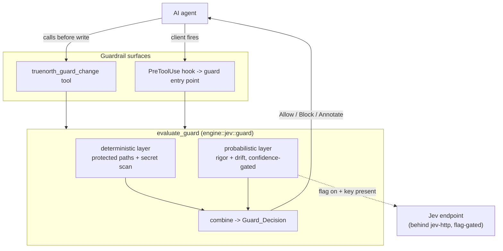
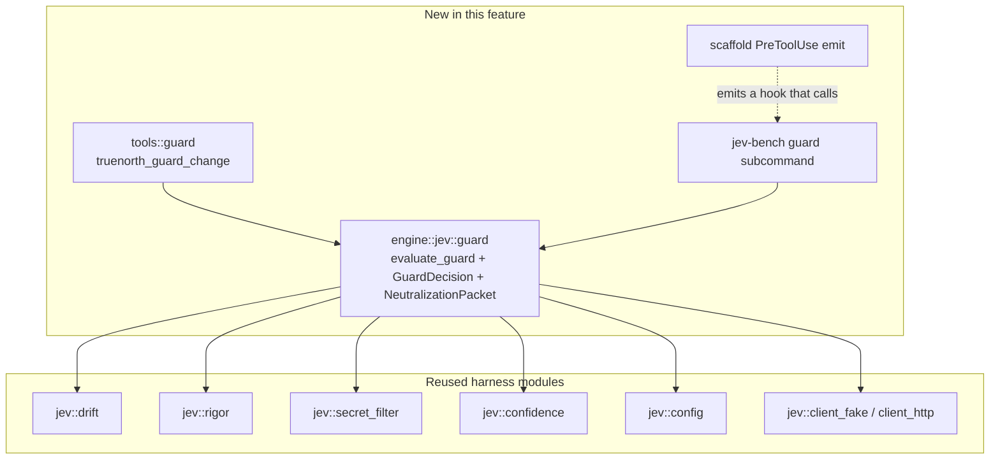

# Design Document

## Overview

This design wires the Jev evaluation harness into the live request path as an active
guardrail. The `jev-integration-eval` harness scores five aspects offline. This feature
adds a pre-write check that runs two of them, rigor and drift, plus two deterministic
model-free checks, and returns one decision: allow, block, or annotate. The goal is active
prevention before a change reaches the filesystem, not an after-the-fact test.

The guardrail reuses the harness whole. It adds no new Jev client, no new wire type, and no
new aspect evaluator. It composes the existing `drift`, `rigor`, `secret_filter`,
`confidence`, and `config` modules behind one decision function, then exposes that function
through two surfaces: a new `truenorth_guard_change` tool and an emitted `PreToolUse` hook.

### Grounding in requirements

Every section cites the requirement numbers (R1 to R9) and the correctness property numbers
(P34 to P41) it satisfies. The requirements live at
`.kiro/specs/jev-active-guardrail/requirements.md`.

### The honest interception boundary

TrueNorth is an MCP server. A tool call an agent makes to a foreign tool, such as a client
`write_to_file` tool, never reaches TrueNorth, so TrueNorth cannot force-intercept it. This
design delivers interception through two honest surfaces:

1. An explicit `truenorth_guard_change` tool the agent calls before it writes. This is the
   surface the agent opts into, and it works with every client.
2. An emitted `PreToolUse` hook that a client fires before a write tool. This is the
   automatic surface, and it holds only where the client honors the hook.

The design never claims TrueNorth force-intercepts a foreign write. The documentation
states the boundary plainly (R9.4).

### The two layers

The guardrail runs two layers in a fixed order.

The deterministic layer runs first, with no Jev call, regardless of the flag. It blocks a
write to a protected path and a write whose content matches the secret denylist. It never
fails open (R2, P34, P35). This is the layer that is genuinely deterministic, because it is
a literal match in the harness code, not a model judgment.

The probabilistic layer runs only when the Jev feature is on and the API key is present. It
scores the change for rigor and drift, gates a block on the configured confidence, and
fails open on any unavailability (R3, R4, R5, P37, P38). It never hard-blocks the developer
on a network dependency.

## Architecture

### System context

The guardrail sits between an agent and a write. The agent either calls
`truenorth_guard_change` directly, or the client fires the emitted `PreToolUse` hook, which
calls a small guard entry point. Both paths run the same `evaluate_guard` decision function.
The deterministic layer reads the protected paths and the secret denylist. The probabilistic
layer calls Jev through the existing harness client, which is the only outbound edge and is
gated by the `jev-http` feature.



Accessible description: an agent reaches the guardrail through two surfaces, the
`truenorth_guard_change` tool and the emitted `PreToolUse` hook. Both call the
`evaluate_guard` core. The core runs a deterministic layer and a probabilistic layer, then
combines them into one decision. Only the probabilistic layer reaches the Jev endpoint, and
only when the flag is on and the key is present. The decision returns to the agent.

### Architecture decisions

#### ADR-G1: compose the harness, add no new Jev surface

Decision. The guardrail composes the existing harness modules (`drift`, `rigor`,
`secret_filter`, `confidence`, `config`, `client_fake`, `client_http`). It adds a new
`engine::jev::guard` module with the decision logic and a thin tool, and adds a `PreToolUse`
emit path. It adds no new Jev client, wire type, or aspect.

Rationale. The harness already models the aspects and the client seam. A second modeling
would drift from the first. Composition keeps one source of truth for the Jev contract.

#### ADR-G2: no central call_tool seam; the guard is an explicit tool plus a hook

Decision. Do not intercept every tool call inside the server. Expose the guard as an
explicit `truenorth_guard_change` tool and an emitted `PreToolUse` hook.

Rationale. The server dispatches tools through rmcp's `#[tool_handler(router =
self.tool_router)]` macro, which generates `call_tool`. A hand-written `call_tool` override
would conflict with the macro, and even a working override would not see a foreign write
tool. The explicit tool plus the hook is the honest interception surface (R1, R7, R9.4). A
foreign write tool is reachable only through the client-fired hook.

#### ADR-G3: the deterministic layer never fails open; the probabilistic layer always does

Decision. The deterministic layer (protected-path match, secret scan) always blocks on a
hit and runs regardless of the flag. The probabilistic layer returns allow-with-a-note on a
flag-off, an absent key, a timeout, a network error, a non-success status, or a
below-threshold confidence.

Rationale. A protected path or a secret is a hard rule that a network outage must not
weaken (R2, P34, P35). A probabilistic judgment is advisory, so a Jev outage must not block
a valid change (R4, P37). The split is the load-bearing safety property of the feature. The
design states it once and the tests pin it.

#### ADR-G4: the guard entry point for the hook is a CLI subcommand behind jev-http

Decision. The `PreToolUse` hook calls a guard CLI entry point. Reuse the bin-crate structure
from `jev-integration-eval`: add a `guard` subcommand to the existing `jev-bench` bin, or a
small sibling bin, gated behind `jev-http`. The hook passes the proposed change on standard
input and reads the exit code.

Rationale. The hook runs out-of-process, so it needs a process to call. The runtime is
already a bin+lib crate, so a subcommand reuses the library with no new crate. The deterministic
layer runs even without the feature, so the hook still blocks a protected path or a secret
when the binary is the default build; the probabilistic layer activates only under the
feature (R7.5, R8.4).

#### ADR-G5: no autonomous repair in this feature

Decision. The guard returns a suggested self-heal instruction in the neutralization packet.
It does not apply the fix and triggers no secondary agent.

Rationale. Auto-repair is a larger, separate capability with its own safety surface. The
guard's job is to decide, not to act (R9.2, R9.3). Auto-repair is a documented future step.

#### ADR-G6: known fidelity gaps against the Jev how-to guide (future refinements)

Decision. Defer two fidelity refinements to a later spec. The current design conforms to the
confirmed Jev API reference. It does not match the full fidelity of the how-to guide's
example. This ADR records the two gaps so a later refinement can close them. Neither gap
blocks the guardrail.

- Per-question minimal state. The how-to guide curates a tight `state` object that carries
  only the fields each question needs. The current design sends the whole secret-filtered
  proposed change as the state. This form is looser than the guide and costs tokens. A
  refinement can curate the state per question before the call, which also eases the token
  budget.
- Structured criteria and instructions. The how-to guide passes structured criteria objects
  (with `what`, `not_for`, `examples`, and `signals` fields) and object-shaped instructions
  (with `question`, `focus`, `compare`, `inspect`). The current wire types model criteria as
  simpler shapes: a `Noul` criteria is an optional string, a `Choice` criteria is a map of
  option to an optional description, and a `Score` criteria is a list of level strings, with a
  plain-string instruction. The simpler shape conforms to the confirmed API reference. It is
  lower fidelity than the how-to example, and it can produce weaker calibration.

Rationale. The load-bearing principles already hold. The design handles deterministic states
with no model call, asks atomic questions in parallel, composes signals with code-side
thresholds, and escalates on low confidence. The two gaps are fidelity, not correctness. The
runtime has made no live Jev call. The docs are ambiguous on whether the plain-string
criteria form is a supported shorthand or a lower-fidelity variant. A refinement must first
confirm the richer shape against the live API before it enriches the wire types. Enriching
the types touches the shared harness `Question` and criteria types from the
jev-integration-eval spec, so it is a cross-cutting change best done as its own spec. This ADR
is a pointer for a future spec, not a task in this plan.

## Components and Interfaces

### Component decomposition

The feature adds one engine module, one tool, one emit path, and one CLI subcommand. Every
new item composes existing harness modules.



Accessible description: the feature adds an `engine::jev::guard` module, a `tools::guard`
tool, a scaffold emit path for the `PreToolUse` hook, and a guard subcommand on the
`jev-bench` bin. The guard module composes the reused harness modules: drift, rigor, secret
filter, confidence, config, and the client. The tool and the CLI call the guard module. The
emitted hook calls the CLI.

### MCP surface

| Tool                     | Kind         | Purpose                                                      |
| ------------------------ | ------------ | ------------------------------------------------------------ |
| `truenorth_guard_change` | active/guard | Score a proposed change and return allow, block, or annotate |

The tool joins the existing router. Every other tool is unchanged (R1.6).

## Low-Level Design

### Module layout

```
runtime/src/engine/jev/
  guard.rs            evaluate_guard, GuardDecision, NeutralizationPacket, ProposedChange,
                      the deterministic layer, the probabilistic layer, the combine step.
  guard_tests.rs      example tests, offline, fake-driven.
  guard_prop_tests.rs P34 to P40 property tests, fake-driven.
runtime/src/tools/
  guard.rs            truenorth_guard_change tool, its schemars args, and the router.
  guard_tests.rs      tool-level tests.
runtime/src/bin/
  jev_bench.rs        gains a `guard` subcommand behind jev-http (ADR-G4).
runtime/src/tools/scaffold/
  templates.rs        gains the PreToolUse hook template.
  mod.rs              gains the emit call for the hook.
```

Register `pub mod guard;` in `engine::jev::mod` and `pub mod guard;` in `tools::mod`, and
add the guard router to the tool-router assembly in `server.rs`.

### The proposed change and the decision types

```rust
/// One proposed change the guard evaluates (R1.2).
#[derive(Debug, Clone, serde::Deserialize, schemars::JsonSchema)]
pub struct ProposedChange {
    /// The target paths the change writes.
    pub paths: Vec<String>,
    /// The new content the change writes.
    pub content: String,
}

/// The guard decision (R1.4).
#[derive(Debug, Clone, PartialEq)]
pub enum GuardDecision {
    /// The change may proceed. Carries advisory notes.
    Allow { notes: Vec<String> },
    /// The change is blocked. Carries the neutralization packet.
    Block(NeutralizationPacket),
    /// The change may proceed, but the guard attaches advisory findings.
    Annotate { notes: Vec<String> },
}

/// The structured block reason (R6).
#[derive(Debug, Clone, PartialEq, serde::Serialize)]
pub struct NeutralizationPacket {
    /// The violated check, for example "protected-path" or "secret" or "drift".
    pub violated_check: String,
    /// The offending value for a deterministic block, such as the protected path.
    pub offending_value: Option<String>,
    /// A remediation hint the agent can act on.
    pub remediation: String,
    /// A suggested self-heal instruction, present when a rigor failure warranted one.
    pub suggested_fix: Option<String>,
}
```

The packet carries no secret content and no API key (R6.3, P40). A deterministic block
names the offending value; a secret block names the matched pattern name, never the secret
value.

### The decision function

```rust
/// Evaluate a proposed change and return one decision (R1.3, R1.4).
///
/// The deterministic layer runs first with no Jev call. The probabilistic layer runs only
/// when `jev_enabled` is true and the client is present, and it fails open.
pub async fn evaluate_guard<C: JevClient>(
    change: &ProposedChange,
    protected_paths: &[String],
    config: &JevConfig,
    jev_enabled: bool,
    client: Option<&C>,
) -> GuardDecision;
```

Pseudocode:

```
function evaluate_guard(change, protected_paths, config, jev_enabled, client):
    # Deterministic layer, no Jev call, never fails open (R2, P34, P35).
    for path in change.paths:
        if path_is_protected(path, protected_paths):        # reuse jev::drift::path_is_protected
            return Block(packet("protected-path", path, "Do not write a protected path."))
    if content_matches_denylist(change.content):            # reuse config::secret_denylist
        return Block(packet("secret", pattern_name, "Remove the secret before the write."))

    # Probabilistic layer, fail open (R3, R4, P36, P37).
    if not jev_enabled or client is None:
        return Allow(notes=["probabilistic layer did not run: jev feature off"])
    if api_key_absent():
        return Allow(notes=["probabilistic layer did not run: no API key"])

    state = build_state_with_secret_filter(repo_root, change.paths)   # R3.2
    if state is Err(SecretResidual):
        return surface_residual_error()                                # R3.3

    rigor = evaluate_rigor(client, state) ; if Err(unavailable): return Allow(note(cause))  # R4.3, P37
    drift = evaluate_drift(client, state, change.paths, protected_paths, config.drift_boundary)
        ; if Err(unavailable): return Allow(note(cause))

    return combine(rigor, drift, config)
```

The combine step:

```
function combine(rigor, drift, config):
    # A candidate block needs a confident signal (R5, P38).
    if drift.out_of_scope and confident(drift, config):        # drift noul >= drift_boundary is the signal
        return Block(packet("drift", None, "Re-align the plan with project scope."))
    if is_rigor_failure(rigor, config.rigor_failure_boundary, config.complexity_boundary):
        fix = decide_self_heal(...)                             # suggested instruction only (R6.2, R9.3)
        if confident_enough_to_block(rigor, config):
            return Block(packet_with_fix("rigor", remediation, fix))
        return Annotate(notes=[rigor_summary, "suggested fix: " + fix])
    return Allow(notes=[])
```

The `confident` and `confident_enough_to_block` helpers apply the configured thresholds,
using the higher `destructive_threshold` for a destructive candidate (R5.3). The combine
step is pure over its inputs, so two evaluations of the same signals return the same
decision (P39), and the property test drives it with no async runtime.

### The tool

```rust
/// The truenorth_guard_change input (R1.1, R1.2).
#[derive(Debug, Deserialize, schemars::JsonSchema)]
pub struct GuardChangeArgs {
    /// The target paths the change writes.
    pub paths: Vec<String>,
    /// The new content the change writes.
    pub content: String,
}
```

The tool validates the input, resolves the protected paths and the config, resolves the
feature flag and the client, calls `evaluate_guard`, and maps the decision to a tool result:
an Allow or an Annotate is a success result carrying the notes; a Block is an MCP error
carrying the neutralization packet (R1.4, R1.5). A malformed input is a typed error naming
the field with no check run (R1.5).

### The PreToolUse hook and the CLI subcommand

The scaffold emits a `.kiro/hooks/jev-guard.json` hook, templated per profile, that matches
a write tool and runs the guard CLI on standard input. The emit reuses the scaffold's
audited `write_repo_seed` path, the same path the git hooks use.

```json
{
  "version": "v1",
  "hooks": [
    {
      "name": "Jev active guardrail",
      "trigger": "PreToolUse",
      "matcher": "write_to_file|fs_write|str_replace",
      "action": { "type": "command", "command": "truenorth-mcp guard --stdin" }
    }
  ]
}
```

The `guard` CLI subcommand (behind `jev-http`, ADR-G4) reads the proposed change on standard
input, runs `evaluate_guard`, prints a block reason to standard error on a Block, and exits
non-zero on a Block and zero on an Allow (R7.2, R7.3, P41). The deterministic layer runs
even in the default build, so a protected-path or a secret block holds without the feature
(R7.5, R8.4). The CLI leaks no key and no secret content (R7.6, P40).

## Data Models

### Configuration reuse

The guardrail reads `JevConfig` from `.agent/config/rules.yml` through the harness reader,
and the `protected_paths` list from the same file. It adds no new config block. The
thresholds are the harness thresholds; the guard hardcodes none (R5.4).

### The neutralization packet on the wire

A Block tool result serializes the `NeutralizationPacket` as JSON in the MCP error data. The
packet names the violated check, the offending value for a deterministic block, a
remediation hint, and an optional suggested fix. It carries no secret and no key (R6.3).

## Correctness Properties

The property set continues the repository numbering and matches the requirements' P34 to
P41. The named fake client drives every property test with no network call.

### Property 34: Deterministic protected-path block

_For all_ proposed changes that write a protected path, `evaluate_guard` returns Block with
no Jev call, regardless of the flag.

**Validates: Requirements 2.1, 2.3, 2.4**

### Property 35: Deterministic secret block

_For all_ proposed changes whose content matches the secret denylist, `evaluate_guard`
returns Block and sends nothing to Jev.

**Validates: Requirements 2.2, 3.3**

### Property 36: Flag-off silence

_For all_ proposed changes, while the Jev feature is off, `evaluate_guard` makes no Jev call
and the probabilistic layer returns Allow with a note.

**Validates: Requirements 4.1, 8.2**

### Property 37: Probabilistic fail-open

_For all_ Jev unavailability outcomes, the probabilistic layer returns Allow, never Block.

**Validates: Requirements 4.2, 4.3, 4.5**

### Property 38: Confidence-gated block

_For all_ candidate block signals and all valid thresholds, the probabilistic layer returns
Block exactly when the confidence is at or above the threshold.

**Validates: Requirements 5.1, 5.2**

### Property 39: Decision determinism

_For all_ signals and all thresholds, two evaluations of the same input return the same
decision.

**Validates: Requirements 5.5**

### Property 40: No secret to Jev

_For all_ proposed changes, no Jev request state and no neutralization packet contains secret
denylist content, and no output contains the API key.

**Validates: Requirements 3.2, 6.3**

### Property 41: Hook exit code

_For all_ guard entry-point outcomes, the hook exits non-zero on a deterministic block and
zero on an allow.

**Validates: Requirements 7.2, 7.3**

## Error Handling

The guardrail reuses the harness `JevError`. It adds no new error type. A malformed tool
input is an MCP invalid-params error naming the field (R1.5). A residual secret surfaces the
harness `SecretResidual` error and makes no call (R3.3). A Jev unavailability is not an
error at the guard boundary: it maps to Allow with a note (R4.3), so the probabilistic layer
never turns an outage into a failure. Library code raises no panic and calls no `unwrap` or
`expect`.

Transactional behavior. The guard performs no write. It only decides, so there is no partial
mutation to roll back. The emitted hook blocks a write by exit code; it never writes.

## Testing Strategy

### Dual approach

Unit and example tests cover the specific decisions and the tool mapping. Property tests
cover the universal properties P34 to P41. The named fake client drives every test offline.
The default build compiles no HTTP client, so the suite makes no network call (R8.2, R8.5).

### Property-based testing

- Library: `proptest`, already a dev-dependency.
- Iterations: a minimum of 100 per property test.
- One property, one property-based test, tagged with the property number.

### Property to test map

| Property | Test target                           | Fake setup                                                     |
| -------- | ------------------------------------- | -------------------------------------------------------------- |
| P34      | `evaluate_guard` protected-path block | generated paths, some protected; assert Block, zero fake calls |
| P35      | `evaluate_guard` secret block         | generated content with injected denylist hits                  |
| P36      | `evaluate_guard` flag off             | flag off; assert Allow-with-note, zero fake calls              |
| P37      | probabilistic fail-open               | fake returns timeout, network, non-success, and absent key     |
| P38      | the combine confidence gate           | generated candidate signals and thresholds                     |
| P39      | the combine determinism               | generated signals; two calls compared equal                    |
| P40      | secret exclusion in state and packet  | generated changes with injected secrets                        |
| P41      | the CLI guard exit code               | a deterministic block and an allow through the CLI entry point |

### Example and boundary tests

- The deterministic layer blocks a `specs/` write and a `LICENSE` write, and a content hit
  on `.env`, `secret`, and `credentials` patterns.
- The tool maps Allow to a success result and Block to an MCP error carrying the packet.
- The tool rejects a malformed input naming the field, with no check run.
- The confidence gate at exactly the threshold, just below, and with the destructive
  threshold for a destructive candidate.
- The flag-off and the absent-key paths return Allow with the correct note.

### Structural checks

- The guard CLI subcommand is behind `jev-http` and carries no `#[test]`.
- `evaluate_guard` and the combine step hold no hardcoded threshold; the values come from
  `JevConfig`.
- The default build compiles no reqwest for the guardrail.

No tool can guarantee ASD-STE100 compliance. Final approval rests with the writer. The
official standard is a free download at asd-ste100.org.
