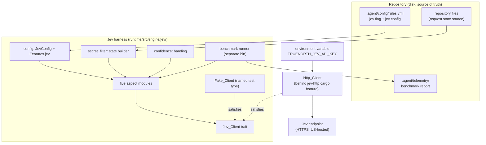
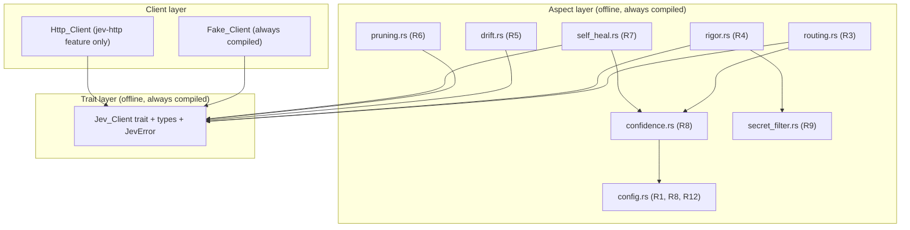

# Design Document

## Overview

This design describes an evaluation harness for the TypeSafe Jev "System One" model
API. The harness measures whether Jev fits five product aspects of TrueNorth-MCP. The
harness is not a live wiring into the request path. No MCP tool, gate, or resource calls
Jev as a result of this feature.

The deliverable is a project-owned `Jev_Client` trait, a named `Fake_Client`, a real
`Http_Client`, five aspect-evaluation modules, unit and property tests driven by the
fake, and a separate benchmark runner. The whole capability sits behind two layers of
opt-in. A runtime `jev` flag in `.agent/config/rules.yml` gates behavior. A Cargo
`jev-http` feature gates the networking dependency. The default build pulls in no HTTP
client, so `cargo test` runs the full suite offline against the fake.

The harness lives under the engine layer, at `runtime/src/engine/jev/`. Jev is
model-agnostic infrastructure, not an MCP tool, so it needs no tool registration and no
vendor scaffolding. This matches the crate's `agnostic` module intent: the runtime never
branches on a model family, and the harness adds no vendor branching (see
`runtime/src/engine/agnostic.rs`).

### Grounding in requirements

Every section below cites the requirement numbers (R1 to R12) and correctness property
numbers (P22 to P33) it satisfies. The requirements live at
`.kiro/specs/jev-integration-eval/requirements.md`.

### Confirmed Jev wire contract

The design pins the confirmed Jev wire contract from the vendor documentation. Content
was rephrased for compliance with licensing restrictions.

- One evaluation endpoint over HTTPS POST.
- Request body JSON: `state` (string, object, or array), `model` (string, set to
  `jev-latest`), `questions` (a map of a caller-chosen id to a Question object).
- Three Question types:
  - `Noul` returns a `noul` value from 0 to 1 with no confidence.
  - `Choice` returns a chosen option, a probability map over the option set that sums to
    1, and a confidence from 0 to 1.
  - `Score` returns a probability-weighted score (the value can land between levels), a
    legend, a probability map, and a confidence from 0 to 1.
- Response body: `model` (string), `answers` (a map of id to Answer), `usage`
  (`input_tokens` and `output_tokens`, both integers).
- Headers: `Authorization: Bearer <API_KEY>` and `Content-Type: application/json`.
- Error statuses: 401 unauthorized, 422 validation (the body names the offending field),
  429 rate limit, 529 overloaded. The client retries 429 and 529 with exponential
  backoff.
- The request token budget is about 32,000 tokens, shared by `state` and `questions`.
- Cited latency is about 70 to 500 ms. There is no official Rust SDK. The service is
  closed-weights, US-hosted, and early-access.
- The per-token price is unverified. Sources conflict. The design treats price as a
  configurable, unverified input and hardcodes no price (R12).

## Architecture

### System context

The harness reads the runtime feature flag and its config from
`.agent/config/rules.yml`, reads the API key from an environment variable, reads
repository content to build request state, and writes a benchmark report under
`.agent/telemetry/` through the existing write guard. The only outbound network path is
the `Http_Client`, and it activates only when the `jev` flag is on and the API key is
present.

The following diagram shows the harness boundary and its collaborators. The harness core
never touches the network. The `Http_Client` is the single outbound edge, gated by the
Cargo `jev-http` feature.



Accessible description: repository files and the rules config flow into the harness. The
harness core holds config, a secret filter, confidence banding, five aspect modules, the
`Jev_Client` trait, the fake client, and the benchmark runner. Both the fake client and
the `Http_Client` satisfy the trait. The `Http_Client` is the only component that reads
the API key from the environment and reaches the Jev endpoint. The benchmark runner
writes its report to `.agent/telemetry/`.

### Architecture decisions

#### ADR-J1: two layers of opt-in

Decision. Gate the harness behind two independent layers. The runtime `jev` flag in
`.agent/config/rules.yml` gates behavior. The Cargo `jev-http` feature gates the
networking dependency and the `Http_Client` type.

Rationale. The runtime flag keeps the harness dormant for a project that does not opt
in, so no state is built and no call is made (R1.4, R1.5, P22). The Cargo feature keeps
the networking crate out of the default build and the offline test suite, so `cargo
test` compiles no HTTP client and makes no network call (R2.4, R11.7, P22). This holds
the three design principles the introduction names: disk is the source of truth, the
runtime is offline-friendly, and no hard network dependency ships by default (R1, R2.7).

Alternative rejected. A single runtime flag with the HTTP client always compiled. This
would pull the networking crate into every build and every `cargo test` run, which
breaks the offline-friendly principle.

#### ADR-J2: the Jev_Client trait as a deep module

Decision. Define `Jev_Client` as a narrow interface with a single method, `evaluate`,
that takes a `JevRequest` and returns `Result<JevResponse, JevError>`. Both the
`Fake_Client` and the `Http_Client` satisfy it. The trait method is async.

Rationale. The styleguide requires wrapping a third-party crate behind a project-owned
trait so a test can fake it. One method is the narrowest interface that covers one Jev
evaluation (R2.1). The async signature fits the tokio runtime the crate already uses
through `rmcp`, and it lets the recommended async HTTP client (`reqwest`) call without a
blocking bridge.

Async versus sync. The runtime is tokio-based, so an async trait method composes with
the existing runtime. The harness is not on the request path, so a blocking client in a
spawned task would also work. The design picks async because the fake implements it
trivially with a ready future, and the real client avoids a `spawn_blocking` hop.

#### ADR-J3: determinism lives in the harness, not the model

Decision. The drift guardrail determinism lives in the harness threshold step and in a
model-free literal path match, not in the Jev model.

Rationale. Jev returns a probability, so the model output is not a deterministic
security boundary. The deterministic boundary is the harness code that applies a fixed
configured threshold to the `noul` value (R5.6, P25), plus a separate model-free layer
that marks a plan out-of-scope when it writes a path matching a `protected_paths` entry
by a literal match (R5.8). The literal layer needs no Jev call, so it holds even when the
flag is off.

#### ADR-J4: pricing is unverified and configurable

Decision. Treat the per-token price as an unverified, configurable input. Hardcode no
price. Account for input tokens and output tokens as two separate values.

Rationale. Public sources conflict on the price and the vendor publishes none, so any
hardcoded number would be wrong or stale (R12.4, R12.8). Separate input and output
accounting supports a configured price that reports output tokens as free (R12.1,
R12.2). Absent a configured price, the harness reports token counts and no monetary cost
(R12.6). A configured price yields an estimate labeled as based on an unverified price
(R12.7).

#### ADR-J5: secret exclusion is load-bearing

Decision. The state builder excludes a denylisted file by path, excludes denylisted file
content, and re-checks the assembled state. A residual match aborts the call.

Rationale. The harness sends repository content to an external US-hosted service, so an
undetected secret would leave the machine. The path match reuses `is_secret_path`, the
content match and the post-exclusion re-check reuse the same compiled `secret_denylist()`
regexes from `runtime/src/config.rs` (R9.1, R9.2, R9.7, P31). A residual match returns a
`SecretResidual` error and makes no call, so the exclusion is fail-closed.

## Components and Interfaces

### Component decomposition

The harness has three layers.

1. The trait layer defines `Jev_Client`, the request and response types, and the
   `JevError` enum. This layer compiles with no networking dependency.
2. The client layer has the `Fake_Client` (always compiled) and the `Http_Client`
   (compiled only under the `jev-http` Cargo feature).
3. The aspect layer has the five aspect modules, the shared confidence banding, the
   secret filter, and the config reader. This layer depends only on the trait layer, so
   the fake drives every aspect test offline.

The next diagram shows the layer dependencies. An arrow means "depends on". The aspect
layer never depends on a concrete client, only on the trait.



Accessible description: the aspect layer holds five aspect modules plus confidence,
secret filter, and config modules. Every aspect module depends on the trait layer.
Routing and self-heal also depend on the confidence module, which depends on config.
Rigor depends on the secret filter. Both the fake client and the `Http_Client` depend on
the trait layer only. No aspect module depends on a concrete client.

## Low-Level Design

### Module layout

The harness lives under `runtime/src/engine/jev/`. Each aspect module keeps its tests in
a sibling file included with the `#[path]` pattern the crate uses (see `config.rs` and
`features.rs`). Each file stays under about 300 lines per the styleguide.

```
runtime/src/engine/jev/
  mod.rs            Jev_Client trait, JevRequest, JevResponse, Question, Answer,
                    Usage, JevError. Registers child modules. Always compiled.
  config.rs         JevConfig read from rules.yml (thresholds, boundaries, retry
                    limit, backoff, timeout, optional price). Always compiled.
  config_tests.rs   Sibling tests for config parse and validation.
  confidence.rs     ConfidenceBand enum and the banding function (R8).
  confidence_tests.rs
  secret_filter.rs  build_state_with_secret_filter (R9, P31).
  secret_filter_tests.rs
  client_fake.rs    Fake_Client, a named test-support type (R2.2).
  client_http.rs    Http_Client + retry_with_backoff. Behind jev-http feature (R2.3).
  client_http_tests.rs
  routing.rs        RoutingOutcome evaluate-and-classify (R3, P28).
  routing_tests.rs
  rigor.rs          RigorReport evaluate (R4, P33).
  rigor_tests.rs
  drift.rs          DriftOutcome evaluate + model-free path match (R5, P25).
  drift_tests.rs
  pruning.rs        PruningOutcome evaluate + chunking (R6, P26, P27).
  pruning_tests.rs
  self_heal.rs      SelfHealDecision evaluate + safety override (R7, P29, P30).
  self_heal_tests.rs
  bench.rs          Benchmark types and runner logic (R11, R12).
  jev_prop_tests.rs Cross-module property tests (P22 to P33) driven by the fake.
```

The separate benchmark runner is a `[[bin]]` gated behind the `jev-http` feature, at
`runtime/src/bin/jev_bench.rs`. It calls `engine::jev::bench`. A `[[bin]]` is not part of
`cargo test`, so the benchmark stays out of the test run (R11.10). The bin selects the
fake or the real client by config (R11.2).

Register the module in `runtime/src/engine/mod.rs`:

```rust
pub mod jev;
```

Add the `jev: bool` field to `Features` in `runtime/src/engine/features.rs`, resolved by
the same reader. Unlike `ontology`, the default is off, so the field uses
`#[serde(default)]` (which defaults `bool` to `false`), not `default = "default_true"`.

### Cargo configuration

Add a `jev-http` Cargo feature and gate the HTTP client crate behind it. The default
build and the offline test suite pull in no networking.

```toml
[features]
default = []
tree-sitter = ["dep:tree-sitter", "dep:tree-sitter-rust"]
# The Jev HTTP client and its networking deps compile only under this feature. The
# harness trait, types, aspects, and the fake compile without it, so `cargo test`
# stays offline (R2.4, R11.7, P22).
jev-http = ["dep:reqwest"]

[dependencies]
# ... existing ...
reqwest = { version = "0.12.9", default-features = false, features = ["rustls-tls", "json"], optional = true }
```

Crate choice. Use `reqwest` pinned to an exact version with `rustls-tls` (no system
OpenSSL) and `json` (typed body). The crate is tokio-based and async, which fits the
runtime and ADR-J2. A blocking `ureq` call in a spawned task is a valid alternative, but
`reqwest` composes with the existing async runtime without a `spawn_blocking` hop, so it
is the smaller change. The dependency is optional, so the default binary and the offline
tests compile no networking.

### The trait and wire types

The trait and every serde type live in `mod.rs` and compile with no networking feature.

```rust
use std::collections::BTreeMap;

/// The single narrow interface for one Jev evaluation (R2.1, ADR-J2).
///
/// Both the Fake_Client and the Http_Client satisfy this trait. The aspect modules
/// depend on the trait, never on a concrete client, so the fake drives every test
/// offline (R2.4).
#[allow(async_fn_in_trait)]
pub trait Jev_Client {
    /// Evaluate one request. Returns the typed response or a typed error.
    ///
    /// # Errors
    ///
    /// Returns a [`JevError`] on a missing key, a residual secret, a non-success
    /// status, a network failure, a timeout, or an invalid response shape.
    async fn evaluate(&self, request: JevRequest) -> Result<JevResponse, JevError>;
}

/// The model id every request carries (R2.10).
pub const JEV_MODEL: &str = "jev-latest";

/// The shared request token budget (R4.10, R6.5, P33).
pub const TOKEN_BUDGET: usize = 32_000;

/// One request body sent to the Jev endpoint (R2, R4.1).
#[derive(Debug, Clone, serde::Serialize)]
pub struct JevRequest {
    /// The evaluation input. A string, object, or array per the wire contract.
    pub state: serde_json::Value,
    /// The model id, always `jev-latest` (R2.10).
    pub model: String,
    /// The caller-chosen question map.
    pub questions: BTreeMap<String, Question>,
}

/// One typed question in the request (R3, R4, R5, R6, R7).
#[derive(Debug, Clone, serde::Serialize)]
#[serde(tag = "type", rename_all = "lowercase")]
pub enum Question {
    /// A yes-or-no question. The answer carries a `noul` value, no confidence.
    Noul {
        instructions: String,
        #[serde(skip_serializing_if = "Option::is_none")]
        criteria: Option<String>,
    },
    /// A question over a fixed option set. Criteria maps each option to a description.
    Choice {
        instructions: String,
        criteria: BTreeMap<String, Option<String>>,
    },
    /// A question over ordered levels. Criteria is an ordered list of >= 2 levels.
    Score {
        instructions: String,
        criteria: Vec<String>,
    },
}

/// One request response (R2).
#[derive(Debug, Clone, serde::Deserialize)]
pub struct JevResponse {
    /// The responding model id.
    pub model: String,
    /// The answer map, keyed by the caller-chosen question id.
    pub answers: BTreeMap<String, Answer>,
    /// The token usage for the request.
    pub usage: Usage,
}

/// One typed answer, matched to its question type (R3, R4, R5, R6, R7).
#[derive(Debug, Clone, serde::Deserialize)]
#[serde(tag = "type", rename_all = "lowercase")]
pub enum Answer {
    /// A Noul answer. A value from 0 to 1. No confidence (R8.5).
    Noul { noul: f64 },
    /// A Choice answer. The chosen option, a probability map, and a confidence.
    Choice {
        choice: String,
        probabilities: BTreeMap<String, f64>,
        confidence: f64,
    },
    /// A Score answer. A weighted score, a legend, a probability map, a confidence.
    Score {
        score: f64,
        legend: BTreeMap<String, String>,
        probabilities: BTreeMap<String, f64>,
        confidence: f64,
    },
}

/// The token usage the response reports (R12.1).
#[derive(Debug, Clone, Copy, serde::Deserialize)]
pub struct Usage {
    /// The input token count.
    pub input_tokens: u64,
    /// The output token count.
    pub output_tokens: u64,
}
```

### Config types

`config.rs` reads a sibling `jev` config block alongside the `features` block. The design
puts the scalar config in a dedicated `jev` block, not in the `features` bool field,
because `features.rs` uses a typed struct per feature and a bool cannot carry scalars.
The reader follows the same pattern as `features::resolve`: an absent file resolves to
the default, a present-but-unreadable file returns a typed `Io` error, a present-but-
unparsable file returns a typed `Parse` error.

```rust
/// The Jev harness config, read from the `jev` block of `.agent/config/rules.yml`
/// (R1.1, R8.6, R12.3). An absent block resolves to the default.
#[derive(Debug, Clone, serde::Deserialize)]
#[serde(default)]
pub struct JevConfig {
    /// The high confidence threshold (R8.2). Range 0 to 1.
    pub confidence_high: f64,
    /// The low confidence threshold (R8.4). Range 0 to 1. Must be <= confidence_high.
    pub confidence_low: f64,
    /// The drift boundary on a Noul value (R5.3). Range 0 to 1.
    pub drift_boundary: f64,
    /// The rigor-failure boundary on a Noul value (R7.1). Range 0 to 1.
    pub rigor_failure_boundary: f64,
    /// The complexity boundary on a Score value (R7.1). Range 0 to 100.
    pub complexity_boundary: f64,
    /// The keep threshold for pruning (R6.2, R6.3). A Score value.
    pub pruning_keep_threshold: f64,
    /// The destructive-action confidence threshold (R7.5, R8.8). Range 0 to 1.
    /// Must be >= confidence_high.
    pub destructive_threshold: f64,
    /// The retry limit for 429 and 529 (R10.3, R10.4, R10.5).
    pub retry_limit: u32,
    /// The maximum backoff between retries.
    pub max_backoff: std::time::Duration,
    /// The wall-clock timeout for one Jev call (R2.5). Defaults to 30 seconds.
    pub timeout: std::time::Duration,
    /// The optional per-token price (R12.3, R12.6). Absent means report no cost.
    pub price: Option<JevPrice>,
}

/// The unverified, configurable per-token price (R12.3, R12.4).
#[derive(Debug, Clone, Copy, serde::Deserialize)]
pub struct JevPrice {
    /// The input-token rate per one million tokens. Must be >= 0 (R12.5).
    pub input_per_million: f64,
    /// The output-token rate per one million tokens. Zero means output is free
    /// (R12.2). Must be >= 0 (R12.5).
    pub output_per_million: f64,
}
```

The API-key environment variable is `TRUENORTH_JEV_API_KEY`. The client reads it at call
time. The key is never written to a config file, a memory file, or a report, and never
appears in a log or an error (R9.3 to R9.6).

### Confidence banding

```rust
/// The three-band confidence policy (R8.1).
#[derive(Debug, Clone, Copy, PartialEq, Eq)]
pub enum ConfidenceBand {
    /// At or more than the high threshold: act automatically (R8.2).
    High,
    /// Between the two thresholds: proceed with confirmation (R8.3).
    Medium,
    /// Less than the low threshold: escalate to a human (R8.4).
    Low,
}

/// Resolve a confidence value to one band (R8.1 to R8.4, R8.7, R8.9, P23, P24).
///
/// # Errors
///
/// Returns [`JevError::InvalidThresholds`] when `low > high` or either threshold is
/// outside 0 to 1 (R8.7).
pub fn confidence_band(
    confidence: f64,
    low: f64,
    high: f64,
) -> Result<ConfidenceBand, JevError> { /* see pseudocode */ }
```

Pseudocode:

```
function confidence_band(confidence, low, high):
    if low is NaN or high is NaN
       or low < 0 or low > 1 or high < 0 or high > 1
       or low > high:
        return Err(InvalidThresholds { low, high })
    if confidence >= high:
        return Ok(High)
    if confidence >= low:
        return Ok(Medium)
    return Ok(Low)
```

The function is total over every finite confidence and every valid threshold pair, so it
returns exactly one band (P23). It reads no state, so the same inputs return the same
band (P24, R8.9).

### Aspect result types

```rust
/// The routing decision for one case (R3.8).
#[derive(Debug, Clone)]
pub struct RoutingOutcome {
    /// The chosen tool, a member of the Routing_Target set (R3.3, P28).
    pub target: String,
    /// The Choice confidence (R3.8).
    pub confidence: f64,
    /// The resolved band: High acts, Medium confirms, Low escalates (R3.5 to R3.7).
    pub band: ConfidenceBand,
}

/// The four-signal rigor report for one input (R4.9).
#[derive(Debug, Clone)]
pub struct RigorReport {
    /// Hallucinated-import probability, 0 to 1 (R4.2).
    pub hallucinated_import: f64,
    /// Violates-conventions probability, 0 to 1 (R4.3).
    pub violates_conventions: f64,
    /// Complexity score, 0 to 100 (R4.4).
    pub complexity: f64,
    /// Contains-secrets probability, 0 to 1 (R4.5).
    pub contains_secrets: f64,
    /// The single-request latency in milliseconds (R4.9).
    pub latency_ms: u64,
}

/// The drift decision for one plan (R5.9).
#[derive(Debug, Clone, Copy)]
pub struct DriftOutcome {
    /// The Noul value, 0 to 1 (R5.9).
    pub noul: f64,
    /// True when out-of-scope (R5.4, R5.5, R5.8).
    pub out_of_scope: bool,
    /// True when the model-free literal path match forced out-of-scope (R5.8).
    pub forced_by_path_match: bool,
}

/// The pruning result for one log (R6.6).
#[derive(Debug, Clone)]
pub struct PruningOutcome {
    /// The kept lines, in original relative order (R6.4, P27).
    pub kept: Vec<String>,
    /// The kept-line count (R6.6).
    pub kept_count: usize,
    /// The dropped-line count (R6.6).
    pub dropped_count: usize,
    /// The input-line count. kept_count + dropped_count == input_count (R6.7, P26).
    pub input_count: usize,
}

/// The self-healing decision for one rigor failure (R7.6).
#[derive(Debug, Clone, Copy)]
pub struct SelfHealDecision {
    /// The chosen typed instruction (R7.2).
    pub instruction: SelfHeal,
    /// The Choice confidence, 0 to 1 (R7.6).
    pub confidence: f64,
}

/// The fixed self-healing instruction set (R7.1, R7.2).
#[derive(Debug, Clone, Copy, PartialEq, Eq)]
pub enum SelfHeal {
    /// Revert the change. A destructive action (R7.5).
    Revert,
    /// Refactor the imports.
    RefactorImports,
    /// Simplify the logic.
    SimplifyLogic,
    /// Escalate to a human (R7.4, R7.5).
    AskHuman,
}
```

### Benchmark types

```rust
/// One aspect's benchmark metrics (R11.3, R11.4, R11.5).
#[derive(Debug, Clone, serde::Serialize)]
pub struct AspectMetrics {
    /// The aspect name.
    pub aspect: String,
    /// The per-invocation latency in milliseconds (R11.3).
    pub latency_ms: Vec<u64>,
    /// The per-case confidence, when the aspect returns one (R11.4).
    pub confidence: Vec<f64>,
    /// The agreement fraction, 0 to 1 (R11.5).
    pub agreement: f64,
    /// The input and output token totals (R12.1).
    pub input_tokens: u64,
    pub output_tokens: u64,
    /// The estimated cost, present only with a configured price (R12.6, R12.7).
    pub estimated_cost: Option<CostEstimate>,
}

/// A cost estimate labeled as based on an unverified price (R12.7).
#[derive(Debug, Clone, Copy, serde::Serialize)]
pub struct CostEstimate {
    pub amount: f64,
    /// Always true. The report labels the estimate as unverified (R12.4, R12.7).
    pub price_unverified: bool,
}

/// One labeled fixture: a repository case paired with an expected answer per aspect
/// (R11.8).
#[derive(Debug, Clone, serde::Deserialize)]
pub struct Fixture {
    pub case_id: String,
    pub state: serde_json::Value,
    pub expected: ExpectedAnswers,
}

/// The expected answers for one fixture, one per aspect (R11.8).
#[derive(Debug, Clone, serde::Deserialize)]
pub struct ExpectedAnswers {
    pub routing: Option<String>,
    pub drift_out_of_scope: Option<bool>,
    pub self_heal: Option<String>,
    // Rigor and pruning expected shapes follow the same optional pattern.
}
```

### Algorithms

#### build_state_with_secret_filter (R9.1, R9.2, R9.7, P31)

```
function build_state_with_secret_filter(repo_root, paths):
    included = []
    for path in paths:
        if is_secret_path(path):          # reuse config::is_secret_path (R9.1)
            continue                        # exclude the file by path
        content = read(path)
        if any secret_denylist regex matches content:   # reuse secret_denylist() (R9.2)
            content = redact_matching_lines(content)     # drop matching content
        included.push({ path, content })
    state = assemble_json(included)
    # Post-exclusion re-check on the assembled state (R9.7).
    if any secret_denylist regex matches serialize(state):
        return Err(SecretResidual)         # abort, make no call
    return Ok(state)
```

The re-check runs on the serialized state, so a secret that survives per-file redaction
still aborts the call. The step is fail-closed: a residual match returns an error and
sends nothing (R9.7, P31).

#### retry_with_backoff (R10)

```
function evaluate_http(request):
    key = env(TRUENORTH_JEV_API_KEY)
    if key is absent:
        return Err(MissingApiKey { var, remediation })   # R2.6, R9.4
    attempt = 0
    backoff = base_backoff
    loop:
        response = http_post(endpoint, request, key, timeout)  # R2.5, R2.9
        match response:
            network error:  return Err(Network)          # R10 network path
            timeout:        return Err(Timeout)           # R10 timeout path
            status 200:     return parse_body(response)   # see response validation
            status 401:     return Err(Unauthorized { var, remediation })  # R10.1
            status 422:     return Err(Validation { field })                # R10.2
            status 429 or 529:
                if attempt >= retry_limit:
                    return Err(RateLimitedOrOverloaded { last_status, attempt })  # R10.5
                sleep(min(backoff, max_backoff))
                backoff = backoff * 2
                attempt = attempt + 1
                continue
            other status:   return Err(UnexpectedStatus { status })   # R10 unexpected path
```

Every branch returns a typed error or a parsed body. No branch calls `unwrap`, `expect`,
or `panic` (R10.6, R10.7, P32).

#### Response validation (R4.6, R4.7, R4.8)

```
function parse_body(response):
    body = deserialize(JevResponse)      # a shape mismatch returns a typed error
    seen = empty set
    for id in body.answers.keys():
        if id in seen:
            return Err(DuplicateAnswer { id })    # R4.8
        seen.insert(id)
    for id in expected_question_ids:
        if id not in body.answers:
            return Err(MissingAnswer { id })      # R4.7
    return Ok(body)
```

Note. A serde map already rejects a duplicate key at the JSON layer. The explicit
duplicate check covers a response shape that carries ids in a list form, so the harness
rejects a duplicate id regardless of the transport shape (R4.8).

#### Aspect flows

Routing (R3). Build one Choice over the Routing_Target set plus `NONE`. Read the Choice
answer. When the chosen option is outside the set, return `UnexpectedOption` and record
no route (R3.4, P29-style closure for routing per P28). Otherwise map the option to the
member, band the confidence, and record the outcome (R3.3, R3.5 to R3.8).

```
function evaluate_routing(client, state, config):
    q = Choice { instructions, criteria: routing_targets_with_none }
    answer = client.evaluate(request_with(q)).choice_answer()
    if answer.choice not in ROUTING_TARGETS and answer.choice != "NONE":
        return Err(UnexpectedOption { option: answer.choice, expected: ROUTING_TARGETS })
    band = confidence_band(answer.confidence, config.confidence_low, config.confidence_high)?
    return Ok(RoutingOutcome { target: answer.choice, confidence: answer.confidence, band })
```

Rigor (R4). Build one request with exactly four questions against one input: three Nouls
(hallucinated import, violates conventions, contains secrets) and one Score (complexity).
Estimate the token budget before the call and reject an over-budget request (R4.10, P33).
Read the four answers by caller-chosen id, rejecting a missing or duplicate id (R4.7,
R4.8). Record the four values and one latency (R4.9).

Drift (R5). First run the model-free literal path match: when the plan writes a path
matching a `protected_paths` entry, mark out-of-scope with `forced_by_path_match = true`
and make no Jev call (R5.8). Otherwise build one Noul, read the `noul` value, and apply
the configured drift boundary in the harness (R5.4 to R5.6). The threshold step carries
the determinism (P25).

```
function evaluate_drift(client, plan, config, protected_paths):
    for written_path in plan.written_paths:
        if literal_match(written_path, protected_paths):     # R5.8, model-free
            return Ok(DriftOutcome { noul: 1.0, out_of_scope: true, forced_by_path_match: true })
    answer = client.evaluate(drift_request(plan)).noul_answer()
    out = answer.noul >= config.drift_boundary               # R5.4, R5.5, deterministic
    return Ok(DriftOutcome { noul: answer.noul, out_of_scope: out, forced_by_path_match: false })
```

Pruning (R6). Build one Score that rates each line's relevance. When the log exceeds the
token budget, split into ordered chunks, each at or under the budget (R6.5). Keep every
line at or over the keep threshold, drop the rest, preserve original order (R6.2 to R6.4,
P27). Record the three counts, which sum to the input count (R6.6, R6.7, P26).

```
function evaluate_pruning(client, log_lines, config):
    chunks = chunk_by_token_budget(log_lines, TOKEN_BUDGET)   # R6.5, order-preserving
    kept = []
    dropped_count = 0
    for chunk in chunks:                # chunks stay in order
        scores = client.evaluate(pruning_request(chunk)).score_answers()
        for (line, score) in zip(chunk, scores):     # zip preserves order
            if score >= config.pruning_keep_threshold:
                kept.push(line)          # R6.2, keeps order (P27)
            else:
                dropped_count += 1       # R6.3
    input_count = len(log_lines)
    return Ok(PruningOutcome { kept, kept_count: len(kept), dropped_count, input_count })
```

Self-heal (R7). Trigger on a rigor failure: any Noul at or over the rigor-failure
boundary, or a complexity Score at or over the complexity boundary (R7.1). Build one
Choice over `REVERT`, `REFACTOR_IMPORTS`, `SIMPLIFY_LOGIC`, `ASK_HUMAN`. Reject an
outside option (R7.3, P29). Apply the safety overrides in order: a confidence under the
low threshold returns `AskHuman` (R7.4); a `REVERT` under the destructive threshold
returns `AskHuman` (R7.5, P30).

```
function evaluate_self_heal(client, rigor, config):
    answer = client.evaluate(self_heal_request(rigor)).choice_answer()
    mapped = map_option(answer.choice)?          # Err(UnexpectedOption) outside set (R7.3)
    if answer.confidence < config.confidence_low:
        return Ok(SelfHealDecision { instruction: AskHuman, confidence: answer.confidence })  # R7.4
    if mapped == Revert and answer.confidence < config.destructive_threshold:
        return Ok(SelfHealDecision { instruction: AskHuman, confidence: answer.confidence })  # R7.5, P30
    return Ok(SelfHealDecision { instruction: mapped, confidence: answer.confidence })        # R7.2
```

#### Token budget estimation (R4.10, P33)

The exact Jev tokenizer is closed, so the harness estimates tokens with a character-based
heuristic. It counts the serialized request bytes and divides by an average bytes-per-
token constant. The estimate is conservative: it rounds up, so a borderline request is
rejected rather than sent over budget.

```
function estimate_tokens(request):
    bytes = len(serialize_json(request))
    return ceil(bytes / BYTES_PER_TOKEN)    # BYTES_PER_TOKEN a named const, e.g. 4

function guard_budget(request):
    if estimate_tokens(request) > TOKEN_BUDGET:
        return Err(BudgetExceeded { estimate, budget: TOKEN_BUDGET })   # R4.10
    return Ok(())
```

The estimate is an approximation, not the vendor count. The design labels it an estimate
and rejects before the call, so no over-budget request leaves the harness (P33).

## Data Models

### Configuration model in rules.yml

The harness adds one flag and one sibling block to `.agent/config/rules.yml`. The flag
joins the existing `features` block. The scalar config lives in a dedicated `jev` block,
because a bool field cannot carry scalars (ADR-J1 rationale, R8.6, R12.3).

```yaml
features:
  ontology: false
  jev: false # default off (R1.2, R1.3)

jev: # read by JevConfig; absent block resolves to the default
  confidence_high: 0.85
  confidence_low: 0.60
  drift_boundary: 0.70
  rigor_failure_boundary: 0.70
  complexity_boundary: 70
  pruning_keep_threshold: 0.50
  destructive_threshold: 0.90
  retry_limit: 3
  max_backoff_ms: 8000
  timeout_ms: 30000
  # price is optional; omit the block to report token counts and no cost (R12.6)
  price:
    input_per_million: 0.042 # unverified, configurable (R12.3, R12.4)
    output_per_million: 0.0 # zero means output is free (R12.2)
```

Field validation. `confidence_low <= confidence_high`, both in 0 to 1 (R8.7).
`destructive_threshold >= confidence_high` and in 0 to 1 (R8.8). Every boundary in its
stated range. A price rate must be finite and non-negative (R12.5). A validation failure
returns a typed error and resolves no config.

### Wire data model

The request and response types map one-to-one to the confirmed wire contract. The
`Question` and `Answer` enums use serde's internal `type` tag, so `serde` selects the
variant from the JSON `type` field. This is the same discipline the crate uses elsewhere:
typed enums over stringly-typed maps. A `Score` legend and probability map are read but
not required for the aspect outcomes, so they are retained for the report and ignored by
the classification logic.

### Fixture model

The benchmark loads a labeled fixture set from a file under the repository. Each fixture
pairs a real repository case with an expected answer per aspect (R11.8). A missing or
unparsable fixture set stops the benchmark before any aspect runs, retains any prior
report, and returns `InvalidFixtureSet` (R11.9).

### Report model

The benchmark writes one report under `.agent/telemetry/` through `write_under_agent`
(R11.6). The report is serialized `AspectMetrics` for the five aspects. The write target
sits under the telemetry area, which `is_excluded_read` marks as excluded from agent
reads, which is correct for an audit artifact. The report excludes the API key and any
Secret_Denylist content (R11.6, P31).

## Correctness Properties

A property is a characteristic or behavior that should hold true across all valid
executions of a system, essentially a formal statement about what the system should do.
Properties serve as the bridge between human-readable specifications and machine-
verifiable correctness guarantees.

The property set continues the repository numbering and matches the requirements' P22 to
P33 one-to-one. The Fake_Client drives every property test with no network call. Each
property maps to a single `proptest` test at a minimum of 100 iterations.

### Property 22: Flag-off silence

_For all_ repository states, while the Jev_Feature_Flag is off, the harness makes no
network call and constructs no Http_Client code path.

**Validates: Requirements 1.4, 1.5, 2.4**

### Property 23: Confidence-band totality

_For all_ confidence values from 0 to 1 and all valid threshold pairs (low <= high, both
in 0 to 1), the harness resolves exactly one Confidence_Band, and for all invalid
threshold pairs it returns the InvalidThresholds error.

**Validates: Requirements 8.1, 8.2, 8.3, 8.4, 8.7**

### Property 24: Confidence-band determinism

_For all_ confidence values and all threshold pairs, two resolutions of the same input
return the same Confidence_Band.

**Validates: Requirements 8.9**

### Property 25: Drift boundary determinism

_For all_ `noul` values and all boundary values, two evaluations of the same input return
the same pass-or-fail result, and a plan that writes a protected path is marked
out-of-scope through the model-free layer with no Jev call.

**Validates: Requirements 5.7, 5.8**

### Property 26: Pruning line conservation

_For all_ input logs and all keep thresholds, the kept-line count plus the dropped-line
count equals the input-line count.

**Validates: Requirements 6.7**

### Property 27: Pruning order preservation

_For all_ input logs and all keep thresholds, the kept lines hold their original relative
order (the kept list is an in-order subsequence of the input).

**Validates: Requirements 6.4**

### Property 28: Routing option closure

_For all_ routing Choice responses, when the chosen option is inside the Routing_Target
set the mapped target is a member of that set, and when the chosen option is outside the
set the harness returns the UnexpectedOption error and records no route.

**Validates: Requirements 3.2, 3.3, 3.4**

### Property 29: Self-healing option closure

_For all_ self-healing Choice responses inside the fixed option set, the harness maps the
option to a typed instruction, and for any option outside the set the harness returns a
typed error.

**Validates: Requirements 7.2, 7.3**

### Property 30: Low-confidence self-healing safety

_For all_ self-healing responses with a `REVERT` option and a confidence less than the
destructive-action threshold, the harness returns the `ASK_HUMAN` instruction and returns
no `REVERT` instruction.

**Validates: Requirements 7.5**

### Property 31: Secret exclusion

_For all_ repository states, no Jev_Request `state` and no report contains content that
matches the Secret_Denylist, no output contains the API key, and a state that still
matches the denylist after exclusion returns the SecretResidual error with no network
call.

**Validates: Requirements 9.1, 9.2, 9.6, 9.7**

### Property 32: Error non-panic

_For all_ Jev error statuses (401, 422, 429, 529, and an unexpected status), the
Http_Client returns a typed error and raises no panic.

**Validates: Requirements 10.6, 10.7**

### Property 33: Token-budget bound

_For all_ built requests, the Jev_Request stays at or less than the 32000-token request
budget, or the harness rejects it before the call with the BudgetExceeded error.

**Validates: Requirements 4.10**

## Error Handling

The harness uses one typed error enum, `JevError`, built with `thiserror`. Library code
raises no panic, calls no `unwrap`, and calls no `expect` (R10.6, R10.7, styleguide).
Every variant message names the offending value, the expected shape, and a remediation
hint where one applies. A secret-related variant names nothing sensitive.

```rust
/// An error from the Jev harness. No variant carries a secret value (R9.6).
#[derive(Debug, thiserror::Error)]
pub enum JevError {
    /// The API-key environment variable is absent (R2.6, R9.4).
    #[error(
        "the Jev API key is not set. Set the `{var}` environment variable to your \
         Jev API key, then re-run. No network call was made."
    )]
    MissingApiKey { var: &'static str },

    /// The assembled state still matched the secret denylist after exclusion (R9.7).
    /// The message names no content, so it leaks no secret.
    #[error(
        "the request state still matched the secret denylist after the exclusion \
         step. No network call was made. Review the denylist and the input paths."
    )]
    SecretResidual,

    /// The endpoint returned 401 (R10.1).
    #[error(
        "the Jev endpoint rejected the API key (401). Check the `{var}` environment \
         variable holds a valid key."
    )]
    Unauthorized { var: &'static str },

    /// The endpoint returned 422 and named a field (R10.2).
    #[error("the Jev endpoint rejected the request (422): the field `{field}` is invalid.")]
    Validation { field: String },

    /// The retry limit was reached for 429 or 529 (R10.5).
    #[error(
        "the Jev endpoint stayed unavailable (last status {last_status}) after \
         {attempts} attempts. Retry later or raise `retry_limit`."
    )]
    RateLimitedOrOverloaded { last_status: u16, attempts: u32 },

    /// The endpoint returned an unmapped status (R10 unexpected path).
    #[error("the Jev endpoint returned an unexpected status {status}.")]
    UnexpectedStatus { status: u16 },

    /// The network call failed before a response (R10 network path).
    #[error("the Jev call failed before a response: {detail}. Check network reach.")]
    Network { detail: String },

    /// The call exceeded the configured timeout (R2.5, R2.8).
    #[error("the Jev call exceeded the {timeout_ms} ms timeout. No result was kept.")]
    Timeout { timeout_ms: u64 },

    /// The built request exceeded the token budget (R4.10, P33).
    #[error(
        "the request estimate {estimate} tokens exceeds the {budget}-token budget. \
         No request was sent. Reduce the state or split the input."
    )]
    BudgetExceeded { estimate: usize, budget: usize },

    /// An expected question id was absent from the response (R4.7).
    #[error("the response is missing the answer for question id `{id}`.")]
    MissingAnswer { id: String },

    /// A question id appeared twice in the response (R4.8).
    #[error("the response carries the answer id `{id}` more than once.")]
    DuplicateAnswer { id: String },

    /// A Choice answer chose an option outside the expected set (R3.4, R7.3).
    #[error(
        "the response chose `{option}`, which is outside the expected set \
         [{expected}]."
    )]
    UnexpectedOption { option: String, expected: String },

    /// The configured threshold pair is invalid (R8.7).
    #[error(
        "invalid confidence thresholds: low {low}, high {high}. Low must be less \
         than or equal to high, and both must be in 0 to 1."
    )]
    InvalidThresholds { low: f64, high: f64 },

    /// A configured price rate is negative or non-numeric (R12.5).
    #[error("invalid price value {value}. A price rate must be a finite value >= 0.")]
    InvalidPrice { value: f64 },

    /// The labeled fixture set is missing or unparsable (R11.9).
    #[error("could not load the fixture set `{path}`: {detail}. No aspect ran.")]
    InvalidFixtureSet { path: String, detail: String },

    /// The config or flag read failed (R1.6, R1.7).
    #[error("could not read the Jev config `{path}`: {detail}.")]
    Config { path: String, detail: String },
}
```

Transactional behavior. A response validation failure retains no partial answer (R4.7,
R4.8). A residual-secret failure sends nothing (R9.7). A budget failure sends nothing
(R4.10). A benchmark fixture failure retains any prior report and runs no aspect (R11.9).

Panic freedom. Every error path returns `Err`. The `secret_denylist()` reuse relies on
the crate's already-compiled static regexes, so no regex compiles at call time in library
code (P32).

## Testing Strategy

### Dual approach

Unit and example tests cover specific scenarios, edge cases, and error conditions.
Property tests cover the universal properties P22 to P33. The two together give
comprehensive coverage. The Fake_Client, a named type per the styleguide, drives every
test offline. The build compiles no HTTP client under `cargo test`, so the suite makes no
network call (R2.4, R11.7, P22).

### Property-based testing

PBT applies to this feature. The harness is data transformation and business logic with
clear input/output behavior: serde round-trips, a total banding function, conservation
and order invariants, and closure over fixed option sets. Each property maps to a single
`proptest` test.

- Library: `proptest`, already a dev-dependency in `runtime/Cargo.toml`.
- Iterations: a minimum of 100 per property test (repo convention).
- Tag: each property test carries a comment `Feature: jev-integration-eval, Property
{number}: {property text}`.
- One property, one property-based test.

### Property to test map

| Property | Test target                                                     | Fake setup                                                            |
| -------- | --------------------------------------------------------------- | --------------------------------------------------------------------- |
| P22      | flag-off harness build makes no call, constructs no Http_Client | generated repo states, flag off; assert zero recorded calls           |
| P23      | `confidence_band` totality and invalid-pair error               | generated confidence and threshold pairs, valid and invalid           |
| P24      | `confidence_band` determinism                                   | generated inputs, two calls compared equal                            |
| P25      | `evaluate_drift` boundary determinism and path-match layer      | generated `noul` values, boundaries, and plans with protected paths   |
| P26      | `evaluate_pruning` line conservation                            | generated logs and keep thresholds via fake Score answers             |
| P27      | `evaluate_pruning` order preservation                           | generated logs; assert kept is an in-order subsequence                |
| P28      | `evaluate_routing` closure, both arms                           | fake Choice answers inside and outside the target set                 |
| P29      | `evaluate_self_heal` closure, both arms                         | fake Choice answers inside and outside the fixed set                  |
| P30      | `evaluate_self_heal` destructive-REVERT override                | fake `REVERT` answers with confidence below the destructive threshold |
| P31      | `build_state_with_secret_filter` exclusion and residual abort   | generated repo states with injected denylist content                  |
| P32      | `Http_Client` error mapping, no panic                           | fake transport returning 401, 422, 429, 529, and an unmapped status   |
| P33      | request builders stay within budget or reject                   | generated states and question sets, some over budget                  |

Note on P32. The `Http_Client` compiles only under the `jev-http` feature, so its
property test is gated behind that feature. To keep P32 in the default offline suite, the
retry-and-status mapping logic is a pure function over a status code and body, separated
from the transport. The pure mapper is always compiled and its property test runs
offline. The transport wiring gets a small feature-gated example test.

### Example, edge-case, and integration tests

- Config read: an absent file resolves to the default; an unreadable file returns the
  `Config` error naming the path (R1.6); a malformed file returns the `Config` parse
  error (R1.7). (EXAMPLE)
- Missing API key: with the env var unset, `MissingApiKey` names `TRUENORTH_JEV_API_KEY`
  and the remediation, and no call is made (R2.6, R9.4). (EXAMPLE)
- Response validation edges: a missing id returns `MissingAnswer`; a duplicate id returns
  `DuplicateAnswer` (R4.7, R4.8). (EDGE_CASE)
- Status handling: a 401 returns `Unauthorized` naming the var; a 422 returns
  `Validation` naming the field (R10.1, R10.2). (EXAMPLE)
- Retry bound: a 429 sequence retries up to the limit, then returns
  `RateLimitedOrOverloaded` naming the last status and attempt count (R10.3 to R10.5).
  (EXAMPLE, feature-gated)
- Cost accounting: input and output tokens tracked separately (R12.1); an output rate of
  zero yields a zero output cost (R12.2); a negative or non-numeric rate returns
  `InvalidPrice` (R12.5); an absent price reports counts and no cost (R12.6). (EXAMPLE and
  EDGE_CASE)
- Benchmark: agreement is the correct fraction over a labeled fixture set (R11.5); the
  report writes under `.agent/telemetry/` through `write_under_agent` and contains no
  denylist content or key (R11.6); a missing fixture set returns `InvalidFixtureSet`
  before any aspect runs and retains any prior report (R11.9). (EXAMPLE)

### Boundary tests

- Thresholds at 0.0, at 1.0, and at low == high (R8.7).
- Token budget at exactly 32000 and just over (R4.10, P33).
- An empty log and a single-line log for pruning (R6.4 to R6.7).
- A rigor request at exactly four questions (R4.1).

### Structural checks

- The benchmark is a `[[bin]]` and carries no `#[test]`, so `cargo test` does not run it
  (R11.10). (SMOKE)
- No per-token price literal appears in an acceptance-tested code path; the price comes
  only from config (R12.8). (SMOKE, code review)
- Both clients satisfy `Jev_Client` (R2.1 to R2.3). (SMOKE, compilation)

No tool can guarantee ASD-STE100 compliance. Final approval rests with the writer. The
official standard is a free download at asd-ste100.org.
