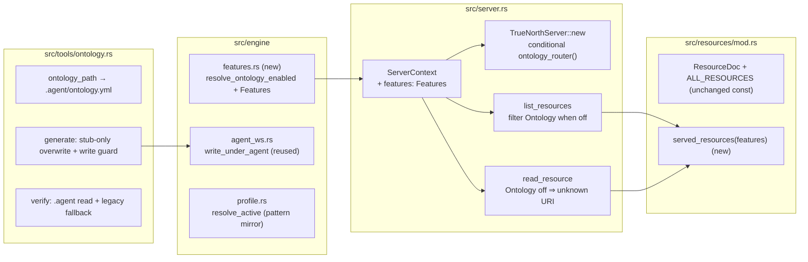

# Design Document: Optional Ontology

> **Builds on the TrueNorth-MCP refactor and Agent Workspace Profiles.** This design
> extends the runtime specified in `.kiro/specs/truenorth-mcp-refactor/design.md` and
> `.kiro/specs/agent-workspace-profiles/design.md`. It keeps the write guard (ADR-0008),
> the `.agent/config/` area, the resource layer, and the backward-compatibility
> guarantees. Property numbers here continue past the profiles design's P6..P15.
> Requirement citations point at `.kiro/specs/optional-ontology/requirements.md` (cited as
> Requirement N or R N.x).

---

## Overview

Optional Ontology adds one per-project boolean and gates the ontology surface on it. The
flag lives at `features.ontology` in `.agent/config/rules.yml`. The default is enabled, so
an existing project keeps its current behavior with no config change.

The feature delivers three changes plus one prose edit:

1. A feature-flag reader that resolves `features.ontology` once at startup and carries the
   value on the shared server context (Requirement 1).
2. Tool gating: the ontology router registers only when the flag is enabled (Requirement 2).
3. Resource gating: the ontology resource lists, reads, and seeds only when the flag is
   enabled. When disabled, the resource URI resolves as unknown and no file is seeded
   (Requirement 3).
4. Backing-path reconciliation: the ontology tools move onto `.agent/ontology.yml` through
   the write guard, keep a legacy read of `specs/ontology.yaml`, and the generate tool
   overwrites only the empty stub (Requirement 4). The `model-domain` skill states the
   guidance is conditional on the flag (Requirement 5).

### Design stance (per the conventions)

Behavior is delivered through typed data and a narrow read, not prose. The flag is data in
an existing config file. The gate is one boolean carried on the context and read at the two
surface-construction sites. The reconciliation removes a second write path, so there is one
ontology backing path behind one write guard. Each change hides behind a narrow interface:
one flag reader, one context field, one path resolver.

### The current state (grounded)

- The ontology tools live at `truenorth-mcp/src/tools/ontology.rs`. `ontology_path` joins
  `specs/ontology.yaml`, and the generate tool writes through a raw `write_new_file`, not
  the write guard. This is the split this design closes.
- The ontology resource lives at `truenorth-mcp/src/resources/mod.rs`. `ResourceDoc::Ontology`
  backs `.agent/ontology.yml`, with `specs/ontology.yaml` as a legacy read fallback. On an
  absent file, `create_ontology_on_read` seeds `ONTOLOGY_SEED` through the write guard.
- The tool router merges in `TrueNorthServer::new` at `truenorth-mcp/src/server.rs`, which
  always adds `Self::ontology_router()`. `list_resources` and `read_resource` map
  `ALL_RESOURCES` and resolve a URI through `ResourceDoc::from_uri`. This design replaces
  the infallible `new` with a fallible `resolve` and a test constructor (§2).
- The shared context `ServerContext` at `truenorth-mcp/src/server.rs` carries `repo_root`
  and `resource_cache`, built by `ServerContext::new(repo_root)`. Today `new` is infallible
  and is called at eleven sites: once in `main.rs` and the rest in tests (some through
  `TrueNorthServer::new`, some building the struct with `ServerContext::new` directly).
- The profile reader `engine::profile::resolve_active` at
  `truenorth-mcp/src/engine/profile.rs` is the pattern this design mirrors for the flag
  read: absent file resolves to the default, present-but-broken returns a typed error.

### External references (attribution)

- **YAML 1.2** parsing through `serde_yaml`, already a crate dependency.
- No new external dependency is introduced.

---

## Part I: High-Level Design

## Architecture

### Component decomposition



### Key Architectural Decisions (ADR-style)

#### ADR-12: The ontology feature flag lives in `.agent/config/rules.yml`

**Context.** Requirement 1 needs a per-project switch. The profiles spec already requires
`.agent/config/rules.yml` for "token caps, human-approval gates, and protected paths"
(profiles Requirement 1.5). A methodology profile field was considered and rejected,
because a project's need for an ontology is orthogonal to its grouping methodology.

**Decision.** Add a `features` block to `.agent/config/rules.yml` with an `ontology`
boolean. Resolve it once at startup with a reader that mirrors `profile::resolve_active`:
absent file resolves to enabled, present-but-unreadable or unparseable returns a typed
error. Preserve unknown fields on read.

**Rationale.** It reuses an existing, required config file. It keeps the profile table
focused on workflow shape (ADR-0009). A standalone `features` block leaves room for future
per-project toggles without another file.

**Consequences.** The reader parses `rules.yml` only for the `features` block, tolerating
every other key, so it does not couple to the full rules schema. The default-enabled rule
keeps every existing project unchanged. Because reading the flag is fallible I/O, the
infallible `ServerContext::new` is replaced by a fallible `resolve` plus a
dependency-injected `with_features` (§2), so no constructor hides the read behind an
infallible name.

#### ADR-13: One ontology backing path, behind the write guard

**Context.** Requirement 4 needs one backing path. Today the tools target
`specs/ontology.yaml` and the resource targets `.agent/ontology.yml`. The
`agent-workspace-profiles` design §2.1 names `.agent/ontology.yml` as the ontology backing
file. The split makes the disabled state ambiguous and lets the generate tool and the
resource seed collide.

**Decision.** Move the ontology tools onto `.agent/ontology.yml`. Route the generate write
through `engine::agent_ws::write_under_agent`, matching the resource seed. Keep a legacy
read of `specs/ontology.yaml` when `.agent/ontology.yml` is absent, mirroring the
resource's `read_path`. Never write the legacy file. Let the generate tool overwrite only
the empty stub ontology and refuse a real ontology.

**Rationale.** A single write path behind the guard makes the invariant hold for both
surfaces. The stub-only overwrite resolves the collision the merge creates: the resource
may seed the stub first, and the generate tool must still succeed against that stub while
refusing to clobber real content.

**Consequences.** The generate tool gains a stub check. The tool messages that name
`specs/ontology.yaml` change to name `.agent/ontology.yml`. A stale resource parse-error
message that names `ontology.yaml` is corrected to name `.agent/ontology.yml`.

---

## Part II: Low-Level Design

## Components and Interfaces

### §1. The Feature Flag Reader (Requirement 1)

A new module `engine::features` at `truenorth-mcp/src/engine/features.rs`.

```rust
// src/engine/features.rs

/// The resolved per-project feature flags.
#[derive(Debug, Clone, Copy, PartialEq, Eq)]
pub struct Features {
    /// Whether the ontology feature is enabled (Requirement 1).
    pub ontology: bool,
}

impl Default for Features {
    /// The default resolution: the ontology feature is enabled (Requirement 1.3, 1.4).
    fn default() -> Self {
        Self { ontology: true }
    }
}

/// An error resolving the feature flags.
#[derive(Debug, Error)]
pub enum FeaturesError {
    /// A present config file could not be read (Requirement 1.7).
    #[error("could not read the feature config `{path}`: {source}")]
    Io { path: String, source: std::io::Error },
    /// A present config file could not be parsed (Requirement 1.8).
    #[error("could not parse the feature config `{path}`: {source}")]
    Parse { path: String, source: serde_yaml::Error },
}

/// The subset of `.agent/config/rules.yml` this reader needs.
///
/// Only the `features` block is deserialized. Every other key is ignored on read, so an
/// unrelated rules key is untouched (Requirement 1.9).
#[derive(Debug, Default, Deserialize)]
struct RulesFeatureView {
    #[serde(default)]
    features: FeaturesBlock,
}

#[derive(Debug, Deserialize)]
struct FeaturesBlock {
    /// Absent resolves to enabled (Requirement 1.4).
    #[serde(default = "default_true")]
    ontology: bool,
}

impl Default for FeaturesBlock {
    fn default() -> Self { Self { ontology: true } }
}

fn default_true() -> bool { true }

/// Resolve the feature flags from `.agent/config/rules.yml` (Requirement 1.2).
///
/// An absent `.agent/`, an absent `.agent/config/`, or an absent `rules.yml` all resolve to
/// [`Features::default`] (Requirement 1.3). A present file with no `features` block or no
/// `ontology` key resolves the flag to enabled (Requirement 1.4). A present file that
/// cannot be read or parsed returns a typed error with no partial value (Requirement 1.7,
/// 1.8). The reader never consults the `.agent/` layout contract (Requirement 1.10).
pub fn resolve(repo_root: &Path) -> Result<Features, FeaturesError>;
```

The read uses `std::fs::read_to_string` and maps any `NotFound` error kind to the default,
so an absent `.agent/` directory, an absent `config/` directory, and an absent file all
resolve to enabled with the same branch. Only a present-but-unreadable file (a non-`NotFound`
I/O error) becomes `FeaturesError::Io`. This is what lets the reader serve the three
onboarding shapes without special-casing them:

- **Greenfield with scaffolding:** the scaffold seeds `rules.yml`; the flag reads normally.
- **bigpowers convert:** a `specs/` cockpit and no `.agent/config/`; the read hits `NotFound`
  and resolves to enabled.
- **Existing project, no TrueNorth scaffolding:** no `.agent/` at all; the read hits
  `NotFound` and resolves to enabled.

The reader deserializes into `RulesFeatureView`, so an unrelated `rules.yml` key does not
break the parse and is preserved on disk untouched (the reader never writes). This matches
the `#[serde(default)]` tolerance already used across the cockpit models. The reader is
standalone: it does not call `agent_ws::read_layout`, so a project with no layout contract
still resolves the flag (Requirement 1.10).

`FeaturesBlock` is a typed struct with one field per known feature, not an open
`map<string, bool>`. A typed block is schema-first and self-documenting, matching the
crate's `schemars`-derived contracts, and a future toggle is a new field with a
`#[serde(default)]`. An unknown `features` key is ignored on read (serde drops it into no
field), which is the intended tolerance, and the round-trip preservation in Requirement 1.9
is satisfied because the reader never writes `rules.yml` back.

### §2. Carry the Flag on the Context (Requirement 1.2)

`ServerContext` at `truenorth-mcp/src/server.rs` gains a `features` field:

```rust
pub struct ServerContext {
    pub repo_root: PathBuf,
    pub resource_cache: ResourceCache,
    /// The resolved per-project feature flags (Requirement 1.2).
    pub features: Features,
}
```

Reading the flag is fallible I/O, so the constructor that reads it must return `Result`. A
`new` that silently defaults the flag would hide a fallible read behind a name that implies
it cannot fail, against the Rust API Guidelines this project follows. The design therefore
replaces the infallible `new` with two honest constructors:

```rust
impl ServerContext {
    /// The production constructor. Resolve the feature flags from disk (Requirement 1.2).
    ///
    /// Reads `.agent/config/rules.yml`. An absent file resolves to the default-enabled
    /// flags (Requirement 1.3). A present-but-broken file returns a typed error naming the
    /// path (Requirement 1.7, 1.8).
    pub fn resolve(repo_root: PathBuf) -> Result<Self, FeaturesError>;

    /// The dependency-injected constructor. Take the flags as data, read no disk.
    ///
    /// This is infallible, so a test builds a deterministic context, enabled or disabled,
    /// without writing a `rules.yml` to a temp dir.
    pub fn with_features(repo_root: PathBuf, features: Features) -> Self;
}
```

`resolve` is `with_features` composed with `features::resolve`. `main.rs` builds the
context through `resolve`, surfacing a broken config as a non-zero exit with the named path
(consistent with `config::get_repo_root`'s error handling in `main`). There is no
constructor that reads config and hides a failure, so the flag read cannot be skipped by
accident.

`TrueNorthServer` follows the same split: `TrueNorthServer::resolve(repo_root) -> Result<Self, FeaturesError>`
for production (used by `main.rs`), building its context through `ServerContext::resolve`. A
`#[cfg(test)]` helper `test_server(repo_root)` builds a default-enabled server through
`with_features`, and tests that need a disabled server pass `Features { ontology: false }`
to `with_features` directly. This keeps the test sites terse and lets the disabled-surface
tests (P17, P18) build a disabled context without touching the filesystem.

### §3. Gate the Ontology Tools (Requirement 2)

`TrueNorthServer` builds the router conditionally. The router assembly is a private helper
that takes an already-built context, so both `resolve` and the test constructor share it:

```rust
impl TrueNorthServer {
    /// Production: resolve the context from disk, then assemble.
    pub fn resolve(repo_root: PathBuf) -> Result<Self, FeaturesError> {
        Ok(Self::from_context(ServerContext::resolve(repo_root)?))
    }

    /// Assemble the server from a built context. The ontology router merges only when the
    /// flag is enabled (Requirement 2.1).
    fn from_context(ctx: ServerContext) -> Self {
        let mut router = Self::skills_router()
            + Self::catalog_router()
            + Self::lifecycle_router()
            + Self::gates_router()
            + Self::tdd_router()
            + Self::bugref_router()
            + Self::scaffold_router();
        if ctx.features.ontology {
            router = router + Self::ontology_router();   // Requirement 2.1
        }
        Self { ctx: Arc::new(ctx), tool_router: router }
    }
}

#[cfg(test)]
impl TrueNorthServer {
    /// A default-enabled server for tests.
    fn test_server(repo_root: PathBuf) -> Self {
        Self::from_context(ServerContext::with_features(repo_root, Features::default()))
    }
}
```

When the flag is disabled, the ontology router is never merged, so neither tool is
advertised or callable (Requirement 2.2). Every other router is unchanged (Requirement
2.3). A disabled-surface test builds the context with `ServerContext::with_features(root, Features { ontology: false })`
and asserts the router omits both ontology tools.

### §4. Gate the Ontology Resource (Requirement 3)

The `ALL_RESOURCES` const stays a fixed five-element array. A new filter selects the served
set from the flags, so the const stays a single source of truth and the filtering is one
function.

```rust
// src/resources/mod.rs

/// The resources served under the resolved feature flags (Requirement 3.1, 3.2).
///
/// When the ontology feature is disabled, `truenorth://ontology` is omitted, so it is
/// neither listed nor resolvable, and a read of it is an unknown resource (Requirement 3.3).
pub fn served_resources(features: Features) -> Vec<ResourceDoc> {
    ALL_RESOURCES
        .into_iter()
        .filter(|doc| *doc != ResourceDoc::Ontology || features.ontology)
        .collect()
}

/// Resolve a URI to a served resource under the flags (Requirement 3.3).
pub fn served_from_uri(uri: &str, features: Features) -> Option<ResourceDoc> {
    served_resources(features).into_iter().find(|doc| doc.uri() == uri)
}
```

`server.rs` wiring:

- `list_resources` maps `served_resources(self.ctx.features)` instead of `ALL_RESOURCES`,
  so a disabled ontology is not listed (Requirement 3.2, 3.6).
- `read_resource` resolves the URI through `served_from_uri(&request.uri, self.ctx.features)`
  instead of `ResourceDoc::from_uri`. A disabled ontology URI returns `None`, which maps to
  the existing "unknown resource" error (Requirement 3.3). Because the resolution fails
  before `read_current` runs, `create_ontology_on_read` never fires, so no file is seeded
  (Requirement 3.4, Property ontology-disabled-no-seed).

When enabled, `served_resources` returns all five and `served_from_uri` behaves like
`from_uri` today, so the seed-on-read behavior is unchanged (Requirement 3.5).

### §5. Reconcile the Ontology Backing Path (Requirement 4)

Changes in `truenorth-mcp/src/tools/ontology.rs`:

#### §5.1. Primary path and legacy read

```rust
/// The primary ontology backing file, matching the resource (Requirement 4.1).
fn ontology_path(repo_root: &Path) -> PathBuf {
    repo_root.join(".agent").join("ontology.yml")
}

/// The legacy backing file, read-only fallback (Requirement 4.3).
fn legacy_ontology_path(repo_root: &Path) -> PathBuf {
    repo_root.join("specs").join("ontology.yaml")
}

/// Resolve the read path: `.agent/ontology.yml`, else the legacy `specs/ontology.yaml`.
fn ontology_read_path(repo_root: &Path) -> Option<PathBuf> {
    let primary = ontology_path(repo_root);
    if primary.is_file() { return Some(primary); }
    let legacy = legacy_ontology_path(repo_root);
    legacy.is_file().then_some(legacy)
}
```

`read_ontology` reads through `ontology_read_path`, so `verify` and the generate stub check
both honor the legacy fallback (Requirement 4.3). The not-found message names
`.agent/ontology.yml` (Requirement 4.8).

#### §5.2. Generate: stub-only overwrite through the write guard

```rust
// truenorth_generate_ontology, after input validation:

let primary = ontology_path(&self.ctx.repo_root);
if primary.is_file() {
    let existing = read_and_parse(&primary)?;
    if !is_empty_stub(&existing) {
        // Requirement 4.7: refuse to clobber a real ontology.
        return Err(ErrorData::invalid_request(
            ".agent/ontology.yml already exists. Edit it directly rather than \
             regenerating.".to_string(),
            None,
        ));
    }
    // else: the file is the empty stub, so overwrite it (Requirement 4.6).
}

let ontology = seed_ontology(&args.domain, &args.source_paths);
let yaml = serde_yaml::to_string(&ontology)?;
// Requirement 4.2: write through the single guard, under `.agent/`.
let rel = std::path::Path::new("ontology.yml");
engine::agent_ws::write_under_agent(&self.ctx.repo_root, rel, &yaml)
    .map_err(|e| ErrorData::internal_error(
        format!("could not write .agent/ontology.yml: {e}. No file was created."), None))?;
```

The success payload names `.agent/ontology.yml` (Requirement 4.8). The raw `write_new_file`
helper is removed, since the guard now owns the write (Requirement 4.2, 4.4).

#### §5.2a. One shared empty-stub definition (Requirement 4.9)

The empty stub is defined once in `engine::spec`, next to the `Ontology` model, so the
resource seed and the tool stub check reference the same source. `Ontology` already derives
`PartialEq`, so the check is an equality against the canonical stub value.

```rust
// src/engine/spec.rs

impl Ontology {
    /// The empty stub ontology: version `1`, empty domain, no entities, no constraints.
    ///
    /// The resource seeds this on first read, and the generate tool overwrites only a file
    /// equal to it. One definition, so the seed and the check cannot drift (Requirement 4.9).
    pub fn empty_stub() -> Self {
        Self {
            version: "1".to_string(),
            domain: String::new(),
            last_updated: String::new(),
            entities: Vec::new(),
            constraints: Vec::new(),
        }
    }

    /// Whether this ontology equals the empty stub (Requirement 4.6).
    pub fn is_empty_stub(&self) -> bool {
        self.domain.is_empty() && self.entities.is_empty() && self.constraints.is_empty()
    }
}
```

`ONTOLOGY_SEED` in `resources/mod.rs` becomes the serialization of `Ontology::empty_stub`,
so the seeded bytes and the check share one origin. A test parses `ONTOLOGY_SEED` and
asserts `is_empty_stub` returns true, pinning the two together. The generate tool calls
`existing.is_empty_stub()` for the overwrite decision (Requirement 4.6), so it never
deadlocks against a resource-seeded stub. The check ignores `last_updated`, because the
seed leaves it empty and the field is not load-bearing for "is this a real ontology."

#### §5.2b. Verify notes an empty stub (Requirement 4.10)

`truenorth_verify_ontology` reads the ontology, and before scanning it checks
`ontology.is_empty_stub()`. When true, it returns a pass carrying an informational note
that the ontology is not yet defined, rather than a bare zero-violation pass:

```rust
if ontology.is_empty_stub() {
    return Ok(CallToolResult::success(vec![ContentBlock::text(
        serde_json::json!({
            "passed": true,
            "files_scanned": 0,
            "note": "The ontology is not yet defined (empty stub). \
                     Run truenorth_generate_ontology to define it."
        }).to_string(),
    )]));
}
```

A filled ontology scans as before. This uses the same shared `is_empty_stub`, so the note
fires for exactly the state the generate tool treats as overwritable.

#### §5.3. Resource message correction (Requirement 4.8)

In `resources/mod.rs`, the ontology parse-error branch names the actual path:

```rust
ResourceReadError::Invalid(format!(".agent/ontology.yml failed to parse: {e}"))
```

### §6. The Skill Edit (Requirement 5)

`skills/model-domain/SKILL.md` "Feed the ontology" section states that the ontology tools
apply only when the project enables the ontology feature, and that the tools are absent
otherwise. The domain-modeling and terminology guidance stays. The edit follows the
strict-tier house writing rules.

## Correctness Properties

Continuing past the profiles design's P6..P15:

- **P16 — ontology-feature-default-resolution (R1.3, R1.4).** An absent `rules.yml`, or a
  present `rules.yml` with no `features.ontology` key, resolves the flag to enabled.
- **P17 — ontology-disabled-surface-absent (R2.2, R3.2, R3.3).** When disabled, neither
  ontology tool is registered, `truenorth://ontology` is not listed, and a read of it is an
  unknown-resource error.
- **P18 — ontology-disabled-no-seed (R3.4).** When disabled, a read of
  `truenorth://ontology` writes no `.agent/ontology.yml` file.
- **P19 — ontology-single-backing-path (R4.1, R4.2, R4.4).** The tools and the resource
  read and write one backing path, `.agent/ontology.yml`, and a write never mutates the
  legacy `specs/ontology.yaml`.
- **P20 — ontology-generate-overwrites-stub-only (R4.6, R4.7, R4.9).** The generate tool
  overwrites `.agent/ontology.yml` only when the existing file equals the shared empty stub,
  and refuses otherwise. The seed and the check reference one definition.
- **P21 — ontology-verify-notes-empty-stub (R4.10).** When the resolved ontology is the
  empty stub, verify passes and returns the not-yet-defined note.

## Testing Strategy

The crate has `tools/ontology_tests.rs`, `resources/*_tests.rs`, `ontology_scan_tests.rs`,
`config_tests.rs`, and `profile_tests.rs`. New coverage:

- **Flag resolution (P16):** absent file, present file with no `features` block, present
  with `ontology: true`, present with `ontology: false`, present with an unrelated key
  preserved, unreadable file, malformed file.
- **Disabled surface (P17):** the merged router omits both ontology tools; `served_resources`
  excludes ontology; `served_from_uri` returns `None` for the ontology URI.
- **Disabled no-seed (P18):** a `read_resource` of the ontology URI under a disabled flag
  writes no `.agent/ontology.yml` (assert the file is absent after the read).
- **Single backing path (P19):** generate writes `.agent/ontology.yml`; verify reads
  `.agent/ontology.yml`; verify falls back to a legacy `specs/ontology.yaml`; a write leaves
  the legacy file untouched.
- **Stub-only overwrite (P20):** generate against an empty stub overwrites; generate against
  a real ontology refuses and leaves the file unchanged; a test parses `ONTOLOGY_SEED` and
  asserts `Ontology::is_empty_stub` returns true, pinning the seed and the check together.
- **Verify notes the stub (P21):** verify against the empty stub passes with the
  not-yet-defined note; verify against a filled ontology scans as before.
- **Enabled parity:** the enabled path matches current behavior, so existing ontology tests
  keep passing with the path updated to `.agent/ontology.yml`.

Run `cargo test`, `cargo fmt`, and `cargo clippy`. CI denies warnings.
