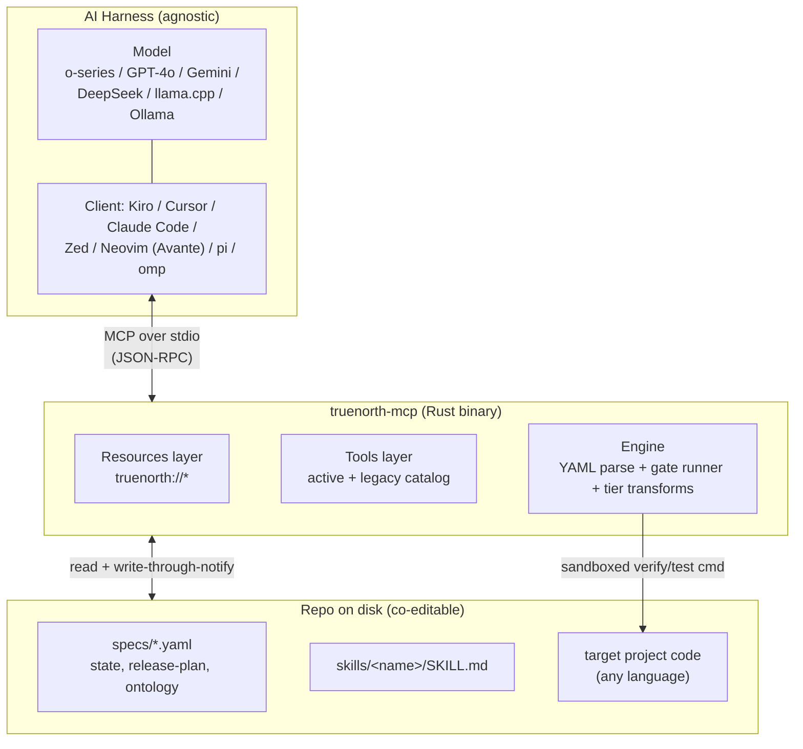
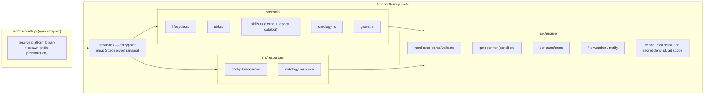
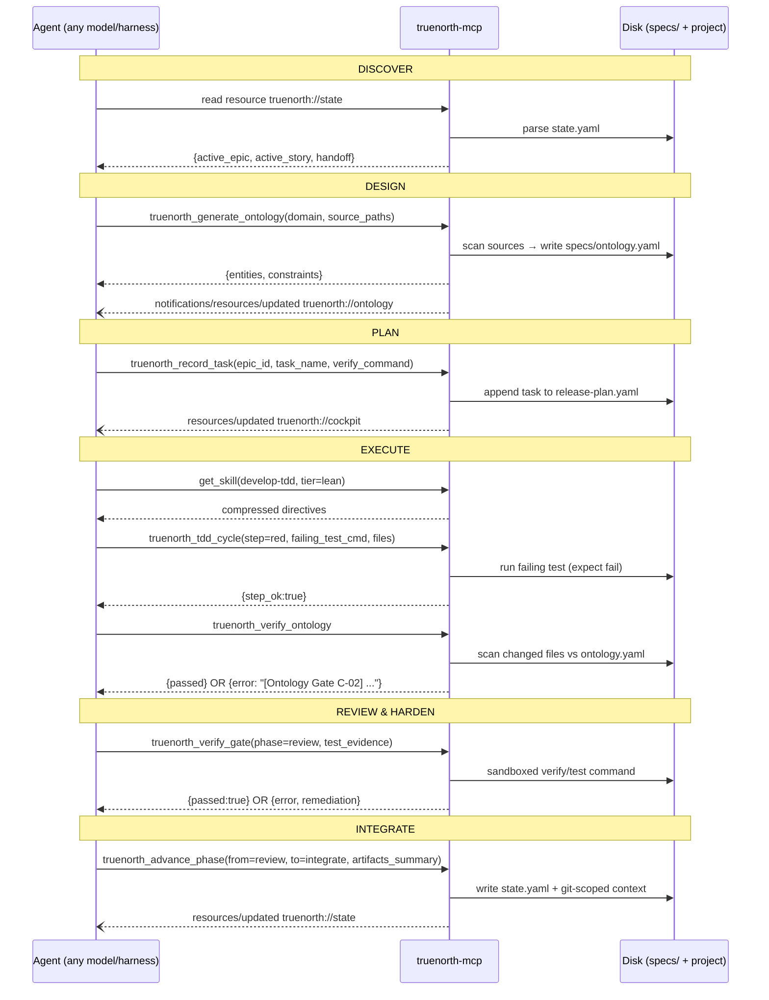

# Design Document: TrueNorth-MCP Refactor

> **Fork notice.** TrueNorth-MCP is a fork of `danielvm-git/bigpowers`. It retains the
> MIT license (Copyright danielvm-git) and preserves the upstream 6-phase vertical-slice
> cadence. This document rebrands and re-architects the passive `bigpowers-mcp` TypeScript
> catalog server into an **active, protocol-first Rust MCP execution runtime**.

---

## Overview

TrueNorth-MCP is "spec-driven engineering discipline for AI agents: protocol-first,
token-lean, and model-agnostic." It replaces the existing TypeScript `bigpowers-mcp`
server (a passive catalog that dumps `SKILL.md` markdown and skill graphs) with a
compiled Rust binary that turns the spec cockpit into a set of **live MCP Resources**
and exposes **active tool contracts**. These are strict JSON-Schema calls that advance lifecycle
state, run quality gates locally, enforce a shared domain ontology, and drive a
Red-Green-Refactor TDD loop.

The refactor pursues three shifts while staying 100% backward-compatible with existing
`specs/` cockpits:

1. **Passive to Active.** Tools stop returning markdown blobs for the model to interpret.
   They perform work: advancing phases, recording tasks, running verify/test commands
   in a sandbox, and rejecting ontology violations with remediation hints.
2. **cat/grep to Resources.** `specs/state.yaml`, `release-plan.yaml`, conventions, and a
   new `ontology.yaml` are served as MCP Resources with `resources/updated` notifications
   so agents read structured, live state instead of shelling out.
3. **Anthropic-coupled to Agnostic.** All Anthropic-specific XML and meta-instruction
   scaffolding is removed. Skills ship in tiered payloads (`full | reasoning | lean`) so
   the same discipline drops into OpenAI o-series, Gemini, DeepSeek, and local weights,
   across Kiro, Cursor, Claude Code, Zed, and Neovim harnesses.

The runtime preserves the upstream lifecycle: **Discover, Design, Plan, Execute,
Review & Harden, Integrate**. The server is Rust. The _projects it governs may be any
language_, so all target-code analysis is language-agnostic by default.

### External references (attribution)

- **rmcp, the official Rust MCP SDK** ([modelcontextprotocol/rust-sdk](https://github.com/modelcontextprotocol/rust-sdk)).
  We use its `#[tool_router]` / `#[tool]` / `Parameters<T>` macro surface with `schemars`
  for tool input schemas, over `StdioServerTransport`. Exact crate version is pinned at
  implementation time (the SDK is pre-/early-1.x and evolving). Treat any version string
  here as illustrative, not load-bearing.
- **MCP Resources and notifications**: the protocol's `resources/list`, `resources/read`,
  and `notifications/resources/updated` primitives ([Model Context Protocol spec](https://modelcontextprotocol.io)).
- **biome / oxlint distribution pattern**: the "thin JS runner + per-platform
  `optionalDependencies` with `os`/`cpu` fields" npm layout used by
  [biome](https://github.com/biomejs/biome) and [oxc/oxlint](https://github.com/oxc-project/oxc).

_Content was rephrased for compliance with licensing restrictions. External claims above
are pointers for implementers to verify at build time, not verified guarantees._

---

# Part I: High-Level Design

## Architecture

This section covers the system context, component decomposition, the 6-phase data-flow,
and the key architectural decisions (ADR-style) that shape the runtime.

### System Context



**Boundary decisions:**

- The server is **not the sole writer**. Humans and other tools edit `specs/` and
  `skills/` directly. The server reads them live and writes _through_ to disk, then emits
  `resources/updated`. Disk is the source of truth.
- The governed project is decoupled from the server's own language. Gate execution and
  ontology scanning treat target code as opaque text/AST by default.

### Component Diagram



## Components and Interfaces

This section defines the MCP interface surface: the tools and resources the server
exposes. The high-level catalog below is the contract summary. The detailed JSON-Schema
tool contracts, tiered `get_skill`, ported legacy catalog tools, gate execution, the
ontology scan/resource-notification mechanism, and the npm wrapper/runner/CI are
specified at the interface level in **Part II, Low-Level Design** (§1 module layout,
§2 per-tool JSON-Schema contracts, §4 tiered skill rendering, §5 gate execution, §6
ontology scan + resource notification, §7 npm distribution).

### MCP Surface Overview

#### Tools

| Tool                                         | Kind             | Purpose                                                   |
| -------------------------------------------- | ---------------- | --------------------------------------------------------- |
| `truenorth_advance_phase`                    | active/state     | Move lifecycle phase, record artifacts summary            |
| `truenorth_record_task`                      | active/state     | Register a task under an epic with a verify command       |
| `truenorth_verify_gate`                      | active/gate      | Run project verify/test cmd in sandbox (or evidence-only) |
| `truenorth_tdd_cycle`                        | active/gate      | Enforce Red → Green → Refactor step transitions           |
| `truenorth_generate_ontology`                | active/ontology  | Synthesize `specs/ontology.yaml` from sources             |
| `truenorth_verify_ontology`                  | active/gate      | Phase-4 gate: reject lexical/semantic drift               |
| `get_skill`                                  | catalog (tiered) | Read a skill at `full \| reasoning \| lean` tier          |
| `index_skills`                               | legacy catalog   | Enumerate `skills/*/SKILL.md` + phase                     |
| `read_skill`                                 | legacy catalog   | Parse a SKILL.md (frontmatter/headings/sections)          |
| `search_skills`                              | legacy catalog   | Substring search over skill metadata                      |
| `build_skill_graph`                          | legacy catalog   | Build + persist entity-relation graph                     |
| `read_graph` / `search_nodes` / `open_nodes` | legacy catalog   | Query the skill graph                                     |
| `get_dependencies`                           | legacy catalog   | Forward/reverse deps + handoff chain                      |
| `get_git_context`                            | legacy catalog   | Git status/log/diff scoped to skills/ + specs/            |
| `validate_skill`                             | legacy catalog   | Lint a SKILL.md against conventions                       |

Legacy catalog tools are **kept alongside** the active tools (extend, do not replace) so
existing agent flows keep working during migration.

#### Resources

| URI                       | MIME               | Contents                                                  |
| ------------------------- | ------------------ | --------------------------------------------------------- |
| `truenorth://state`       | `application/yaml` | Current epic / active story / handoff (from `state.yaml`) |
| `truenorth://cockpit`     | `application/yaml` | Release plan + product boundary + acceptance criteria     |
| `truenorth://conventions` | `text/markdown`    | Compressed coding standards                               |
| `truenorth://ontology`    | `application/yaml` | Domain terms, entities, constraints (`ontology.yaml`)     |

All resources support `notifications/resources/updated` when the backing file changes.

### Data Flow Across the 6-Phase Lifecycle



### Key Architectural Decisions (ADR-style)

#### ADR-1 (DECISION POINT): Verify-gate execution strategy, run locally by default

**Context.** `truenorth_verify_gate` must confirm that a phase's quality bar is met. The
options are (a) execute the project's verify/test command _inside the server_ and judge
the result, or (b) accept model-supplied "evidence" text only.

**Decision.** **Execute the verify/test command locally by default**, inside a sandbox
(wall-clock timeout, working-directory scoping, command allowlist), and return
`{passed:true}` or `{error, remediation_hints}`. Provide an explicit **evidence-only
opt-out** (`mode: "evidence"`) for environments where in-server execution is undesirable
(no toolchain, hosted sandbox, security policy).

**Rationale.** Evidence-only lets a model hallucinate a green build. Local execution is
the whole point of an _active_ runtime. The gate is trustworthy because the server, not
the model, observed the exit code. Sandboxing bounds the blast radius.

**Consequences.** The server needs a subprocess sandbox and an allowlist config. Hosted
deployments must be able to disable execution cleanly (opt-out mode).

#### ADR-2 (DECISION POINT): Ontology analysis strategy, regex heuristic baseline + AST plug-in

**Context.** `truenorth_verify_ontology` scans target-project code for `prohibited_aliases`
and constraint violations. Target projects may be any language. Options: (a) full AST
analysis (accurate, per-language, heavy), (b) language-agnostic identifier/regex scan
(portable, coarser).

**Decision.** **Language-agnostic identifier/regex heuristic scan is the baseline** for
all projects, with a **pluggable AST-analyzer extension point** for supported languages
(tree-sitter grammars behind a `OntologyAnalyzer` trait). The server never assumes the
analyzed project is Rust.

**Rationale.** A refactor runtime that only governs Rust projects would be useless for
the model-agnostic, polyglot audience. Regex gives universal coverage on day one. AST
plug-ins add precision where a grammar exists without blocking the baseline.

**Consequences.** Regex has false positives/negatives (comments, strings). Remediation
messages must be actionable and cite the constraint id so a human can override.

#### ADR-3: Rust rewrite over TypeScript

Compiled single-file binary, ~5MB per platform, no Node runtime dependency at execution
time, strong typing for the YAML cockpit via `serde`, and `schemars`-derived tool schemas.
Trade-off: cross-compilation complexity, handled by a CI matrix (Part II).

#### ADR-4: Server is a syncing peer, not sole writer

Disk stays authoritative and co-editable. The server reads live, writes through, and
notifies. This removes the need for `sync-skills.sh` (skills/resources are served
dynamically at runtime) while keeping humans and other tools first-class editors.

#### ADR-5: Distribution, recommend manual platform packages

Two viable npm distribution paths (detailed in Part II §7). We **recommend the
biome/oxlint-style manual platform packages** under `optionalDependencies` over a
`cargo-dist` postinstall fetch, because it avoids postinstall network calls (better for
locked-down CI and offline installs) and lets pnpm resolve only the matching binary.

---

# Part II: Low-Level Design

## §1. Rust Crate Module Layout

```
truenorth-mcp/                     # Rust crate (replaces bigpowers-mcp/)
├── Cargo.toml                     # rmcp, serde, serde_yaml, schemars, tokio, tree-sitter (opt)
├── src/
│   ├── index.rs                   # entrypoint: build server, StdioServerTransport, serve
│   ├── config.rs                  # root resolution, secret denylist, git scope dirs
│   ├── resources/
│   │   ├── mod.rs                 # ResourceProvider: list + read + subscribe
│   │   ├── cockpit.rs             # truenorth://state, ://cockpit, ://conventions
│   │   └── ontology.rs            # truenorth://ontology
│   ├── tools/
│   │   ├── mod.rs                 # #[tool_router] aggregation
│   │   ├── lifecycle.rs           # advance_phase, record_task
│   │   ├── tdd.rs                 # tdd_cycle
│   │   ├── skills.rs              # get_skill (tiered) + legacy catalog tools
│   │   ├── ontology.rs            # generate_ontology, verify_ontology
│   │   └── gates.rs               # verify_gate
│   └── engine/
│       ├── mod.rs
│       ├── spec.rs                # serde models for state.yaml / release-plan.yaml / ontology.yaml
│       ├── validate.rs            # backward-compat schema validation
│       ├── gate_runner.rs         # sandboxed subprocess execution
│       ├── tier.rs                # strip_meta_steps / compress_for_local_context
│       ├── watcher.rs             # notify-based file watch → resources/updated
│       ├── git.rs                 # git-scoped status/log/diff (ports git-context.ts)
│       └── ontology_scan.rs       # OntologyAnalyzer trait: regex baseline + AST plug-in
├── skills/                        # lean rewritten SKILL.md (co-editable)
├── specs/                         # default template scaffold (init)
└── npm/                           # distribution wrapper (see §7)
    ├── package.json
    ├── bin/truenorth.js
    └── packages/                  # @truenorth-mcp/<platform> stubs
```

### Config (ports `config.ts`)

```rust
/// Resolve repo root: TRUENORTH_ROOT env → cwd → parent-of-package.
/// A dir is the repo root when it contains both `skills/` and `specs/`.
pub fn get_repo_root() -> PathBuf;

pub const MAX_READ_SKILL_BYTES: usize = 512 * 1024;

/// Secret denylist (ports SECRET_DENYLIST): .env, *.pem, secret, credentials.
pub fn secret_denylist() -> &'static [Regex];

/// Git scope dirs (ports GIT_SCOPE_DIRS): ["skills", "specs"].
pub const GIT_SCOPE_DIRS: [&str; 2] = ["skills", "specs"];

/// Sandbox config for gate execution (ADR-1).
pub struct SandboxConfig {
    pub timeout: Duration,          // wall-clock kill
    pub working_dir: PathBuf,       // scoped to repo root
    pub allowlist: Vec<String>,     // permitted command binaries
    pub execution_enabled: bool,    // false ⇒ evidence-only default
}
```

### Entrypoint

```rust
// src/index.rs
#[tokio::main]
async fn main() -> anyhow::Result<()> {
    let ctx = ServerContext::new(config::get_repo_root())?;
    ctx.spawn_watcher();                       // engine::watcher → resources/updated
    let service = TrueNorthServer::new(ctx);   // #[tool_router] + ServerHandler
    let transport = (tokio::io::stdin(), tokio::io::stdout()); // rmcp stdio
    service.serve(transport).await?.waiting().await?;
    Ok(())
}
```

## §2. Per-Tool JSON-Schema Input Contracts

Schemas are derived from `schemars`-annotated structs and surfaced through rmcp's
`Parameters<T>` wrapper. Each contract is shown as the derived JSON Schema.

### `truenorth_advance_phase`

```rust
#[derive(Deserialize, JsonSchema)]
pub struct AdvancePhaseArgs {
    /// Phase to move from.
    pub from_phase: Phase,
    /// Phase to move to.
    pub to_phase: Phase,
    /// One-paragraph summary of artifacts produced this phase.
    pub artifacts_summary: String,
}
#[derive(Deserialize, Serialize, JsonSchema)]
#[serde(rename_all = "kebab-case")]
pub enum Phase { Discover, Design, Plan, Execute, Review, Integrate }
```

```json
{
  "type": "object",
  "required": ["from_phase", "to_phase", "artifacts_summary"],
  "properties": {
    "from_phase": { "enum": ["discover", "design", "plan", "execute", "review", "integrate"] },
    "to_phase": { "enum": ["discover", "design", "plan", "execute", "review", "integrate"] },
    "artifacts_summary": { "type": "string", "minLength": 1 }
  }
}
```

### `truenorth_record_task`

```json
{
  "type": "object",
  "required": ["epic_id", "task_name", "verify_command"],
  "properties": {
    "epic_id": { "type": "string", "pattern": "^e[0-9]+([a-z0-9-]*)?$" },
    "task_name": { "type": "string", "minLength": 1 },
    "verify_command": {
      "type": "string",
      "minLength": 1,
      "description": "Shell command that proves the task done"
    }
  }
}
```

### `truenorth_verify_gate` (ADR-1)

```json
{
  "type": "object",
  "required": ["phase"],
  "properties": {
    "phase": { "enum": ["discover", "design", "plan", "execute", "review", "integrate"] },
    "test_evidence": {
      "type": "string",
      "description": "Required when mode=evidence; ignored when executing"
    },
    "mode": { "enum": ["execute", "evidence"], "default": "execute" }
  }
}
```

Result: `{ "passed": true }` or `{ "error": "...", "remediation_hints": ["..."] }`.

### `truenorth_tdd_cycle`

```json
{
  "type": "object",
  "required": ["step", "failing_test_cmd", "files_to_modify"],
  "properties": {
    "step": { "enum": ["red", "green", "refactor"] },
    "failing_test_cmd": { "type": "string", "minLength": 1 },
    "files_to_modify": { "type": "array", "items": { "type": "string" }, "minItems": 1 }
  }
}
```

### `truenorth_generate_ontology`

```json
{
  "type": "object",
  "required": ["domain", "source_paths"],
  "properties": {
    "domain": { "type": "string", "minLength": 1 },
    "source_paths": {
      "type": "array",
      "items": { "type": "string" },
      "minItems": 1,
      "description": "PRDs / spec files / code dirs to scan"
    }
  }
}
```

### `truenorth_verify_ontology`

```json
{
  "type": "object",
  "properties": {
    "scope_paths": {
      "type": "array",
      "items": { "type": "string" },
      "description": "Optional; defaults to git-changed files in scope"
    }
  }
}
```

### `get_skill` (tiered)

```json
{
  "type": "object",
  "required": ["name"],
  "properties": {
    "name": { "type": "string", "description": "Skill dir name (verb-noun, kebab-case)" },
    "tier": {
      "enum": ["full", "reasoning", "lean"],
      "description": "Overrides TRUENORTH_TIER env for this call"
    }
  }
}
```

### Legacy catalog tools (ported verbatim in contract)

`index_skills{}`, `read_skill{name}`, `search_skills{query, exact?}`,
`build_skill_graph{force?}`, `read_graph{}`, `search_nodes{query}`,
`open_nodes{names[]}`, `get_dependencies{name}`,
`get_git_context{action: status|log|diff = status}`, `validate_skill{name}`.

## Data Models

The runtime's data models are the YAML cockpit files, all typed via `serde` in
`engine::spec` (§1). Three model groups matter:

1. **`specs/state.yaml` + `release-plan.yaml`**: the existing bigpowers cockpit shapes,
   modeled with unknown-field preservation. Their fields and the backward-compat
   validation layer are specified in **§3.1 Cockpit state models** and
   **§8 Backward Compatibility & Migration** (schema tolerance, `bigpowers_version`,
   legacy phase-name mapping, `#[serde(flatten)]` catch-all).
2. **`specs/ontology.yaml`**: the new domain-ontology schema (§3.2 below).
3. **Backward-compat schema/validation layer**: `engine::validate`, which validates
   reads/writes against the existing bigpowers schemas so tool mutations never corrupt
   human-authored state (detailed in §8).

### §3.1. Cockpit state models (`state.yaml` / `release-plan.yaml`)

`engine::spec` models the observed bigpowers shapes. `state.yaml` carries
`active_epic`, `active_story`, `handoff.{next_skill,context,epic}`,
`metrics.skill_timings`, `release.*`, and `git.branch`. The `release-plan.yaml` file carries
`release.*`, `build_order[]`, and `done_epics_summary`. Unknown fields are preserved via
a `#[serde(flatten)]` catch-all so writes never drop human edits. The validation rules
and legacy-version tolerance are specified in §8.

### §3.2. `specs/ontology.yaml` Schema

```rust
#[derive(Serialize, Deserialize, JsonSchema)]
pub struct Ontology {
    pub version: String,               // schema version, e.g. "1"
    pub domain: String,
    pub last_updated: String,          // ISO-8601
    pub entities: Vec<Entity>,
    pub constraints: Vec<Constraint>,  // global rules
}

#[derive(Serialize, Deserialize, JsonSchema)]
pub struct Entity {
    pub name: String,
    pub description: String,
    pub primary_key: String,
    pub invariants: Vec<String>,
    pub states: Vec<String>,
    /// state -> allowed next states
    pub transitions: BTreeMap<String, Vec<String>>,
    /// forbidden synonyms that indicate lexical drift
    pub prohibited_aliases: Vec<String>,
}

#[derive(Serialize, Deserialize, JsonSchema)]
pub struct Constraint {
    pub id: String,   // "C-NN"
    pub rule: String,
}
```

Example emitted file:

```yaml
version: '1'
domain: order-fulfilment
last_updated: 2026-07-26T00:00:00Z
entities:
  - name: Order
    description: A customer purchase moving through fulfilment.
    primary_key: order_id
    invariants:
      - 'total_cents >= 0'
      - 'cancelled orders cannot ship'
    states: [draft, placed, shipped, cancelled]
    transitions:
      draft: [placed, cancelled]
      placed: [shipped, cancelled]
      shipped: []
      cancelled: []
    prohibited_aliases: [is_deleted, order_no, purchase]
constraints:
  - id: C-01
    rule: 'Soft deletion uses deleted_at: Option<DateTime<Utc>>, never a boolean flag.'
  - id: C-02
    rule: 'Boolean state flags (is_*) are prohibited; model states explicitly.'
```

## §4. Tier-Transform Algorithms

`TRUENORTH_TIER` env sets the default. `get_skill(tier=...)` overrides per call.

```rust
pub enum Tier { Full, Reasoning, Lean }

/// full = verbatim SKILL.md.
pub fn render_skill(md: &str, tier: Tier) -> String {
    match tier {
        Tier::Full      => md.to_string(),
        Tier::Reasoning => strip_meta_steps(md),
        Tier::Lean      => compress_for_local_context(strip_meta_steps(md)),
    }
}
```

### `strip_meta_steps` (reasoning tier)

Targets native reasoning models (o1/o3, DeepSeek-R1) that do not need hand-held
chain-of-thought scaffolding. Ports the intent of the TS `stripMetaSteps`.

```pseudo
ALGORITHM strip_meta_steps(md) -> String
  Precondition: md is valid markdown
  Postcondition: directive content preserved; meta/guardrail lines removed
  BEGIN
    lines <- split_lines(md)
    out <- []
    FOR each line IN lines:
      IF matches_meta_pattern(line): CONTINUE   // "Think step by step", "Let's reason...",
                                                //  redundant "IMPORTANT:" restatements,
                                                //  Anthropic-style <thinking> XML wrappers
      IF is_duplicate_guardrail(line, out): CONTINUE
      out.push(line)
    RETURN collapse_blank_runs(join(out))
  END
```

### `compress_for_local_context` (lean tier)

Targets local 7B to 70B weights with tight context budgets. Ports `compressForLocalContext`.

```pseudo
ALGORITHM compress_for_local_context(md) -> String
  Postcondition: output is imperative directives only, ≤ target token budget
  BEGIN
    md   <- drop_sections(md, ["Rationale","Background","Examples (verbose)"])
    md   <- headings_to_bullets(md)          // "## Step 1: Do X" -> "- Do X"
    md   <- imperative_rewrite(md)            // strip hedges: "you should" -> ""
    md   <- dedupe_directives(md)
    RETURN truncate_to_budget(md, TIER_LEAN_TOKEN_BUDGET)
  END
```

Both transforms are pure functions (input md maps to output md). They have no I/O and are
unit-testable with golden fixtures.

## §5. Gate Execution Sandboxing (ADR-1)

```rust
pub struct GateOutcome { pub passed: bool, pub error: Option<String>,
                         pub remediation_hints: Vec<String> }

pub fn run_gate(cmd: &str, cfg: &SandboxConfig) -> GateOutcome
```

```pseudo
ALGORITHM run_gate(cmd, cfg) -> GateOutcome
  Precondition: cfg.working_dir is under repo_root
  BEGIN
    IF NOT cfg.execution_enabled:
      RETURN evidence_only_outcome()          // caller must supply test_evidence
    bin <- first_token(cmd)
    IF bin NOT IN cfg.allowlist:
      RETURN fail("command '{bin}' not in allowlist",
                  hints=["add to allowlist or use mode=evidence"])
    child <- spawn(cmd, cwd=cfg.working_dir, env=sanitized_env())
    result <- wait_with_timeout(child, cfg.timeout)   // SIGKILL on timeout
    IF result.timed_out: RETURN fail("gate timed out after {cfg.timeout}",
                                     hints=["reduce test scope or raise timeout"])
    IF result.exit_code == 0: RETURN GateOutcome{passed:true}
    RETURN fail(tail(result.stderr, 2KB), hints=parse_remediation(result))
  END
```

Sandbox properties:

- wall-clock timeout with hard kill
- `cwd` pinned under repo root
- binary allowlist
- environment sanitized (drop tokens/secrets matching the denylist)

## §6. Ontology Scan + Resource Notification

### `OntologyAnalyzer` trait (ADR-2)

```rust
pub trait OntologyAnalyzer {
    /// Return violations for a single file's contents.
    fn scan(&self, path: &Path, contents: &str, ont: &Ontology) -> Vec<Violation>;
}
pub struct Violation { pub constraint_id: String, pub path: PathBuf,
                       pub line: usize, pub message: String }

pub struct RegexAnalyzer;   // language-agnostic baseline (always available)
pub struct AstAnalyzer;     // tree-sitter plug-in for supported languages (optional)
```

```pseudo
ALGORITHM verify_ontology(scope) -> Result
  BEGIN
    ont <- parse(specs/ontology.yaml)
    files <- scope OR git_changed_files_in_scope()
    violations <- []
    FOR each f IN files:
      analyzer <- pick_analyzer(f.language)   // AST if grammar exists, else Regex baseline
      violations += analyzer.scan(f, ont)
    IF violations empty: RETURN {passed:true}
    RETURN {error: first_violation.formatted(), all: violations}
  END
```

Formatted error example:

```
Error [Ontology Gate C-02]: 'is_deleted' violates specs/ontology.yaml.
Use 'deleted_at: Option<DateTime<Utc>>' instead.  (src/models/order.rs:42)
```

### Resource notification (write-through-notify)

```mermaid
sequenceDiagram
    participant Ext as Human / other tool
    participant W as engine::watcher (notify crate)
    participant S as truenorth-mcp
    participant A as Agent

    Ext->>+W: edit specs/state.yaml on disk
    W->>S: fs event (debounced)
    S->>S: re-parse + validate
    S--)A: notifications/resources/updated truenorth://state
    A->>S: resources/read truenorth://state
    S-->>-A: fresh YAML
```

Tool writes follow the same path: a tool mutates the file, the watcher (or an explicit
post-write hook) fires `resources/updated`. Debounce coalesces rapid edits. Validation
failures surface as a resource read error, not a crash.

## §7. npm / pnpm Binary Distribution

### Root wrapper `npm/package.json`

```json
{
  "name": "truenorth-mcp",
  "version": "0.1.0",
  "bin": { "truenorth-mcp": "bin/truenorth.js" },
  "optionalDependencies": {
    "@truenorth-mcp/darwin-arm64": "0.1.0",
    "@truenorth-mcp/darwin-x64": "0.1.0",
    "@truenorth-mcp/linux-x64": "0.1.0",
    "@truenorth-mcp/linux-arm64": "0.1.0"
  }
}
```

Each platform stub, for example `@truenorth-mcp/darwin-arm64/package.json`:

```json
{
  "name": "@truenorth-mcp/darwin-arm64",
  "version": "0.1.0",
  "os": ["darwin"],
  "cpu": ["arm64"],
  "files": ["truenorth-mcp"]
}
```

pnpm evaluates `os`/`cpu` and downloads **only** the ~5MB matching binary.
`windows-x64` is an **open decision** (stdio + path semantics + `.exe` naming need a pass
before committing).

### `bin/truenorth.js` runner

```js
#!/usr/bin/env node
// Thin runner: resolve the platform-native binary and spawn it (stdio passthrough).
const { spawnSync } = require('node:child_process');
const platformPkg = `@truenorth-mcp/${process.platform}-${process.arch}`;
let binary;
try {
  binary = require.resolve(`${platformPkg}/truenorth-mcp`);
} catch {
  console.error(`truenorth-mcp: no prebuilt binary for ${process.platform}-${process.arch}`);
  process.exit(1);
}
const res = spawnSync(binary, process.argv.slice(2), { stdio: 'inherit' });
process.exit(res.status ?? 1);
```

MCP client config uses `command: "pnpm", args: ["dlx", "truenorth-mcp"]`.
`npx truenorth-mcp init` scaffolds the `specs/` cockpit from the crate's template.

### Distribution options (ADR-5)

| Option                                        | Mechanism                                                                    | Pros                                                                                       | Cons                                                                        |
| --------------------------------------------- | ---------------------------------------------------------------------------- | ------------------------------------------------------------------------------------------ | --------------------------------------------------------------------------- |
| **A. Manual platform packages (recommended)** | biome/oxlint pattern: per-platform npm packages under `optionalDependencies` | No postinstall network call. Offline/locked-CI friendly. pnpm fetches only matching binary | Must publish N packages per release                                         |
| B. cargo-dist / postinstall fetch             | postinstall script downloads binary from GitHub Releases                     | One npm package. Simpler publish                                                           | Postinstall network call (blocked in some CI). Checksum/verification burden |

**Recommendation: Option A.** It avoids postinstall side effects and integrates cleanly
with pnpm's platform resolution.

### CI cross-compile matrix (GitHub Actions, on release tags)

```yaml
strategy:
  matrix:
    include:
      - target: aarch64-apple-darwin # → @truenorth-mcp/darwin-arm64
        os: macos-14
      - target: x86_64-apple-darwin # → @truenorth-mcp/darwin-x64
        os: macos-13
      - target: x86_64-unknown-linux-gnu # → @truenorth-mcp/linux-x64
        os: ubuntu-latest
      - target: aarch64-unknown-linux-gnu # → @truenorth-mcp/linux-arm64
        os: ubuntu-latest
# steps: cargo build --release --target ${{matrix.target}}
#        → package binary into platform pkg → npm publish --access public
#        → publish root wrapper last
```

## §8. Backward Compatibility & Migration

- **Read/validate existing schemas.** `engine::spec` models `state.yaml` and
  `release-plan.yaml` with the observed shapes (for example `active_epic`, `active_story`,
  `handoff.{next_skill,context,epic}`, `metrics.skill_timings`, `release.*`,
  `git.branch`, release-plan `release.*`, `build_order[]`, `done_epics_summary`). Unknown
  fields are preserved (`#[serde(flatten)]` catch-all) so writes do not drop human edits.
- **`bigpowers_version` tolerated.** The version key and legacy phase names (`Build`,
  `Verify`, `Release`, `Sustain` from `phase-map.ts`) are mapped onto the 6-phase model:
  `Build→Execute`, `Verify→Review`, `Release/Sustain→Integrate`.
- **`sync-skills.sh` retired.** Skills and resources are served dynamically at runtime, so
  no build-step markdown fan-out is needed.
- **Migration path.**
  1. Install `truenorth-mcp`, then point MCP client at it.
  2. Existing `specs/` works unchanged (validated read).
  3. Run `truenorth_generate_ontology` once to seed `specs/ontology.yaml` (new file only).
  4. Optionally regenerate skills at `lean`/`reasoning` tiers. `full` remains the source.
  5. Legacy catalog tools keep answering existing flows during the transition.

## §9. Repository Structure & Cleanup

The fork inherits a large upstream surface built for a **bash + markdown**
sync/generation pipeline and a fan-out of per-harness skill mirrors. Under the MCP-first
Rust runtime, skills and cockpit state are served **dynamically at runtime** (tools +
resources), so that static machinery becomes dead weight. This section defines the lean
target layout and an explicit disposition inventory. Cleanup is tied to the migration
path in §8: removals that back live behavior happen only **after** the Rust crate + npm
wrapper reach parity.

### §9.1. Target Repository Layout

```
truenorth-mcp/                     # lean end-state
├── Cargo.toml                     # Rust crate (§1)
├── src/                           # runtime: resources/, tools/, engine/ (§1)
├── npm/                           # distribution wrapper (§7)
│   ├── package.json
│   ├── bin/truenorth.js           # thin runner (replaces bin/*.js + install.sh)
│   └── packages/                  # @truenorth-mcp/<platform> stubs
├── skills/                        # canonical lean SKILL.md sources (source-of-truth only)
│   └── <verb-noun>/SKILL.md
├── specs/                         # cockpit only (load-bearing files the runtime reads)
│   ├── state.yaml
│   ├── release-plan.yaml
│   ├── execution-status.yaml
│   ├── ontology.yaml              # new (§3.2)
│   ├── product/                   # SCOPE / VISION
│   └── adr/
├── .github/                       # workflows, issue/PR templates, release matrix (§7)
├── .kiro/                         # spec workspace (this design lives here)
├── README.md CHANGELOG.md CONTRIBUTING.md CONTRIBUTORS.md
├── THIRD-PARTY-NOTICES.md CONVENTIONS.md constitution.md LICENSE
├── package.json                   # retooled for the npm wrapper
├── .releaserc.json
└── .gitignore .gitattributes .gitmessage
```

Everything not in this tree is upstream process exhaust or superseded by the runtime.

### §9.2. Disposition Inventory

Dispositions: **Remove** (delete, staged in git for reversibility), **Consolidate** (fold
into the runtime or a single source-of-truth), **Keep** (load-bearing or standard),
**Gitignore** (stop tracking a build artifact).

| Path                                                                                                                                                                                      | Disposition        | Rationale                                                                                                                                                                                                     |
| ----------------------------------------------------------------------------------------------------------------------------------------------------------------------------------------- | ------------------ | ------------------------------------------------------------------------------------------------------------------------------------------------------------------------------------------------------------- |
| `.cline/ .codebuddy/ .codex/ .continue/ .copilot/ .cursor/ .gemini/ .kilocode/ .opencode/ .pi/ .qwen/ .trae/ .windsurf/` (13 mirrors)                                                     | Consolidate        | Per-harness static skill mirrors. MCP + tiered rendering make model/harness agnosticism dynamic, so mirrors are obsolete. A single `skills/` remains                                                          |
| `ANALISE_CONSOLIDACAO.md`, `GSD_WORKFLOW_ANALYSIS_VS_BIGPOWERS.md`, `VALIDACAO_CONTRA_GSD.md`                                                                                             | Remove             | One-off upstream analysis/planning docs. Superseded by this design + the ADRs                                                                                                                                 |
| `CLAUDE.md`, `GEMINI.md`, `opencode.json`, `.mcp.json`                                                                                                                                    | Remove             | Vendor-coupled prompt scaffolding / per-tool agent config. Refactor drops Anthropic/Gemini coupling (see Overview shift 3)                                                                                    |
| `bigpowers-mcp/` (old TypeScript server)                                                                                                                                                  | Remove (sequenced) | Replaced by the Rust crate. Remove **only after** crate reaches parity (§9.3, §8)                                                                                                                             |
| `scripts/` (~120 shell/python: `sync-skills.sh`, `generate-skill-index.sh`, `build-skill-graph.sh`, `golden-g*.sh`, `generate-*-wiki.sh`, `validate-*.sh`)                                | Remove (sequenced) | Old markdown-sync + skill-index + golden-suite + validate/generate pipeline. Redundant under dynamic serving. `install.sh`, `mcp-server.js` superseded by npm wrapper + Rust binary. Remove only after parity |
| `kernel/` (src+templates), `profiles/` (`node-service.md`, `solo-git.md`, `swift.md`, `typescript-vue.md`), `extensions/`, `hooks/` (`pre/`, `pre-tool-use.sh`), `dashboard/`, `website/` | Remove             | Upstream infra with no runtime counterpart. The runtime governs projects via tools/resources, not kernel templates or web UI                                                                                  |
| `bin/` (`bigpowers.js`, `bigspec`, `init.js`, `setup.js`), `index.js`                                                                                                                     | Consolidate        | Superseded by `npm/bin/truenorth.js` runner + `init` scaffold (§7)                                                                                                                                            |
| `requirements.txt`                                                                                                                                                                        | Remove             | Python dependency manifest for the retired script pipeline                                                                                                                                                    |
| `skills-lock.json`, `SKILL-INDEX.md`, `templates/`                                                                                                                                        | Remove             | Auto-generated index/lock + upstream templates. Regenerable/obsolete under dynamic `get_skill` / `index_skills`                                                                                               |
| `specs/IMPACT-*.md`, `REBORN-*.md`, `PLAN-*.md`, `RESEARCH-*.md`, `STOCKTAKE-*.md`, `TRACEABILITY*.md`, `*_LATEST.md`                                                                     | Remove             | Upstream process artifacts. Not read by the runtime                                                                                                                                                           |
| `specs/*.json` side-cars (`blind-spots`, `drift-report`, `skill-graph`, `receipts`, `rule-matrix`, `traceability-matrix`, `import-boundaries`)                                            | Remove             | Regenerable graph/report state. The graph is rebuilt on demand by `build_skill_graph`, not persisted upstream-style                                                                                           |
| `specs/adr-wiki/ epics-wiki/ skills-wiki/ codebase-wiki/ conventions-wiki/`                                                                                                               | Remove             | Generated wiki output from `generate-*-wiki.sh`. Obsolete without the generator pipeline                                                                                                                      |
| `specs/state.yaml`, `release-plan.yaml`, `execution-status.yaml`, `ontology.yaml`, `product/`, `adr/`                                                                                     | Keep               | Load-bearing cockpit the runtime reads/writes (Resources layer, §3.1/§3.2)                                                                                                                                    |
| `allure-results/`                                                                                                                                                                         | Gitignore          | Test/build artifact. Belongs in `.gitignore`, not version control                                                                                                                                             |
| `skills/` (canonical `SKILL.md`)                                                                                                                                                          | Keep               | Source-of-truth for tiered rendering. Mirrors are dropped, sources retained                                                                                                                                   |
| `README.md`, `LICENSE` (MIT, danielvm-git ©), `CHANGELOG.md`, `CONTRIBUTING.md`, `CONTRIBUTORS.md`, `THIRD-PARTY-NOTICES.md`, `CONVENTIONS.md`, `constitution.md`                         | Keep               | Standard project docs (README already rewritten for truenorth. LICENSE retains upstream copyright)                                                                                                            |
| `.github/`, `.gitignore`, `.gitattributes`, `.gitmessage`, `.releaserc.json`, `package.json`, `.kiro/`                                                                                    | Keep               | Standard VCS/CI config, retooled `package.json`, and the spec workspace                                                                                                                                       |

### §9.3. Sequencing & Safety

- **Parity before removal.** `bigpowers-mcp/` and any `scripts/` referenced by a retained
  skill must be removed **only after** the Rust crate + npm wrapper reach parity, per the
  §8 migration path (legacy catalog tools answer existing flows during the transition).
- **Reversible deletions.** Deletions are destructive. Stage each removal batch as its own
  git commit so cleanup is reversible via history rather than an atomic mass delete.
- **Artifacts, not source.** `allure-results/` is gitignored rather than tracked.
  `SKILL-INDEX.md` and the skill-graph / JSON side-cars are regenerable and obsolete under
  dynamic serving, so they are removed rather than re-synced.

### §9.4. What Replaces the Removed Machinery

| Removed                                                             | Replaced by                                                                                               |
| ------------------------------------------------------------------- | --------------------------------------------------------------------------------------------------------- |
| `sync-skills.sh`, `generate-skill-index.sh`, `build-skill-graph.sh` | Dynamic MCP tools/resources: `get_skill` (tiered), `index_skills`, `build_skill_graph` at runtime (ADR-4) |
| 13 per-harness skill mirror directories                             | One canonical `skills/` served through tiered rendering (§4). Agnosticism is runtime, not static fan-out  |
| `bin/*.js`, `install.sh`, `mcp-server.js`                           | `npm/bin/truenorth.js` runner + platform packages + `init` scaffold (§7)                                  |
| Static full-markdown mirrors                                        | Tiered rendering (`full \| reasoning \| lean`) computed per call (§4)                                     |

## Correctness Properties

The following properties are the design's load-bearing invariants. Each is stated as a
universally-quantified claim and is the target of a property-based or example test in the
Testing Strategy below.

### Property 1: Ontology gate rejects prohibited aliases

For every scanned file `f` and every
entity alias `a ∈ ontology.prohibited_aliases`, if `a` appears as an identifier in `f`
then `verify_ontology` returns at least one `Violation` citing the owning constraint id.
Formally: `∀ f, a ∈ prohibited_aliases : occurs(a, f) ⟹ ∃ v ∈ verify_ontology().violations`.

### Property 2: verify_gate passes only on exit 0

`truenorth_verify_gate(mode=execute)`
returns `{passed:true}` **if and only if** the sandboxed command terminated with exit
code `0` within the timeout. Timeouts, non-zero exits, and allowlist rejections always
yield `{error, remediation_hints}`. The model can never induce a pass without a real
exit-0 observation by the server.

### Property 3: State files stay schema-valid after any mutation

For every tool `t` that
writes a cockpit file and every valid pre-state `S`, applying `t` yields a post-state
`S'` that still validates against the existing bigpowers schemas (via
`engine::validate`), and every unknown field present in `S` is preserved in `S'`.

### Property 4: Tier transforms preserve invariants

For every skill `md` and tier
`∈ {reasoning, lean}`, `render_skill(md, tier)` never removes or alters directive
content that encodes invariants or acceptance criteria. Only meta/guardrail scaffolding
is stripped or compressed. `render_skill(md, full) == md` (identity).

### Property 5: No dangling references after cleanup

For every path `p` referenced by
a retained skill (`skills/*/SKILL.md`) or by the runtime (config, resource URIs, cockpit
reads), after the §9 cleanup `p` still resolves on disk. Formally:
`∀ p ∈ referenced_paths(retained_skills ∪ runtime) : exists(p)`. Removals in §9.2 target
only paths in the unreferenced upstream-exhaust set, so cleanup never breaks a live
reference.

## Error Handling

| Scenario                          | Detection                                                          | Response                                                                                    | Recovery                                                       |
| --------------------------------- | ------------------------------------------------------------------ | ------------------------------------------------------------------------------------------- | -------------------------------------------------------------- |
| Gate failure (non-zero exit)      | `run_gate` observes exit ≠ 0                                       | `{error: <stderr tail>, remediation_hints}` (P2)                                            | Agent fixes code, re-runs the gate                             |
| Sandbox timeout                   | wall-clock kill in `wait_with_timeout`                             | `fail("gate timed out …", hints=["reduce test scope or raise timeout"])`                    | Narrow test scope or raise `SandboxConfig.timeout`             |
| Command not in allowlist          | `bin ∉ cfg.allowlist`                                              | `fail("command '<bin>' not in allowlist", hints=["add to allowlist or use mode=evidence"])` | Add binary to allowlist or switch to `mode=evidence`           |
| Unsupported platform (npm runner) | `require.resolve` throws in `bin/truenorth.js`                     | stderr `no prebuilt binary for <platform>-<arch>`, `exit 1`                                 | Install a supported platform package or build from source      |
| Malformed / missing spec file     | YAML parse or schema validation fails in `engine::spec`/`validate` | resource read returns an error (not a crash). Tool writes are rejected pre-write            | Fix the YAML. Watcher re-validates on next edit                |
| Ontology violation                | `verify_ontology` finds a `Violation`                              | `Error [Ontology Gate C-NN]: … Use … instead. (path:line)`                                  | Rename per remediation, or override by editing `ontology.yaml` |

Design principle: every failure carries an actionable remediation hint and, where a
constraint is involved, cites the constraint id so a human can locate and override it.

## Testing Strategy

- **Unit (tools/engine).** `serde` round-trip on the real `specs/*.yaml` fixtures (compat).
  Pure-function golden tests for `strip_meta_steps` / `compress_for_local_context`
  (validates P4). `run_gate` with a fake command runner covering pass / fail / timeout /
  allowlist-reject / evidence-only (validates P2).
- **Gate sandbox tests.** Assert timeout hard-kill, `cwd` pinning under repo root,
  allowlist enforcement, and environment sanitization (secret denylist) behave per §5.
- **Ontology scan tests.** `RegexAnalyzer` fixtures asserting `is_deleted` maps to C-02 with the
  exact remediation string. Transition/invariant violation cases (validates P1).
- **Backward-compat fixture tests.** Round-trip and mutate the existing bigpowers
  `state.yaml` / `release-plan.yaml` fixtures through each writing tool and assert the
  result still validates and preserves unknown fields (validates P3).
- **Integration.** In-process MCP client drives `resources/list` + `resources/read` and a
  full Discover-to-Integrate tool sequence against a temp repo. Assert `resources/updated`
  fires after a disk edit (watcher) and after a tool write.
- **npm wrapper resolution tests.** Verify `bin/truenorth.js` resolves the correct
  `@truenorth-mcp/<platform>-<arch>` package and exits `1` with a clear message on
  unsupported platforms.
- **CI cross-compile matrix.** The release matrix (§7) builds every target
  (`aarch64-apple-darwin`, `x86_64-apple-darwin`, `x86_64-unknown-linux-gnu`,
  `aarch64-unknown-linux-gnu`) and publishes per-platform packages. This makes sure that each binary
  compiles and packages before the root wrapper is published.
- **Contract.** Snapshot each tool's derived JSON Schema to catch accidental breaking
  changes.
