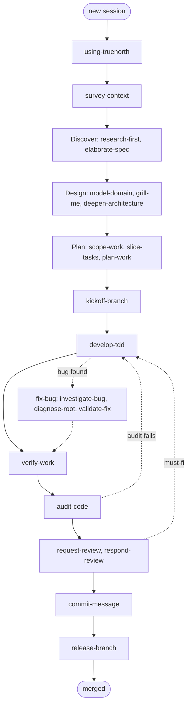

# The skill workflow

This page shows how the skills chain from one to the next. Each skill does one thing and
names the next by its "Use it after X, before Y" triggers. Together they form the
lifecycle arc.

For the per-skill detail, follow the phase pages linked from the [Skill index](Skill-index).

## The lifecycle at a glance

The skills organize around the developer lifecycle. The bootstrap skill routes you in; each
phase hands off to the next.

```text
BOOTSTRAP   using-truenorth (first time only)
DISCOVER    survey-context, research-first, elaborate-spec, map-codebase, search-skills
DESIGN      model-domain, define-language, grill-me, grill-with-docs, deepen-architecture,
            design-interface
PLAN        scope-work, slice-tasks, plan-work, plan-tests, plan-release, plan-refactor,
            assess-impact, run-planning, change-request, seed-conventions
INITIATE    kickoff-branch, guard-git, hook-commits, setup-environment
SPIKE?      spike-prototype (feeds back to plan-work)
EXECUTE     develop-tdd + enforce-first, execute-plan, build-epic, delegate-task,
            dispatch-agents
VERIFY      verify-work, run-evals, validate-contracts, smoke-test
BUG?        investigate-bug, diagnose-root, fix-bug, validate-fix
REVIEW      audit-code, request-review, respond-review, simulate-agents, security-review,
            trace-requirement, gate-trace
INTEGRATE   commit-message, release-branch, deploy, publish-package
SUSTAIN     session-state, organize-workspace, stocktake-skills (ongoing)
UTILITY     terse-mode, craft-skill, edit-document, write-document (any phase)
```

## The core loop



## Where to start

The `using-truenorth` bootstrap routes you from your situation to the first skill.

| Your situation                       | First skill to call                     |
| ------------------------------------ | --------------------------------------- |
| A greenfield project, nothing set up | `seed-conventions`                      |
| An existing project, a new task      | `survey-context`                        |
| A vague idea that needs shaping      | `elaborate-spec`                        |
| A plan exists, ready to implement    | `kickoff-branch`, then `develop-tdd`    |
| A bug to fix                         | `investigate-bug`                       |
| Code ready for review                | `audit-code`                            |
| Shipping a feature                   | `commit-message`, then `release-branch` |
| Unsure which skill fits              | `search-skills`                         |

## The planning spine

Three skills run in strict order, and each states it is not a substitute for the others.

```text
scope-work  ->  slice-tasks  ->  plan-work
(what/why)      (vertical slices)  (verifiable tasks)
```

`plan-tests` slots between `slice-tasks` and `plan-work` for a P0 or P1 group.
`assess-impact` runs before `plan-work` when a change touches a shared module.

## The bug-fix chain

```text
investigate-bug  ->  diagnose-root  ->  develop-tdd  ->  validate-fix  ->  release-branch
```

`investigate-bug` runs `diagnose-root` internally for the four-phase root-cause analysis.
`fix-bug` orchestrates the whole chain and sets the `fix_bug` flow.

## The review and integrate arc

```text
verify-work  ->  audit-code  ->  request-review  ->  respond-review  ->  commit-message  ->  release-branch
```

`audit-code` is self-review, run first. `request-review` dispatches independent reviewers
with a dual-blind AND gate. `security-review` and `gate-trace` gate the merge in
`release-branch`.

## Orchestration

`orchestrate-project` coordinates a multi-phase project through the core loop with hard
gates, calling `build-epic` once per story in the build phase. `compose-workflow` chains
skills into a named recipe. The Standard Recipe Library maps a command to a skill chain:

| Command        | Skill chain                                               |
| -------------- | --------------------------------------------------------- |
| `/check-stack` | survey-context, assess-impact, setup-environment          |
| `/plan`        | survey-context, research-first, plan-work                 |
| `/tdd`         | develop-tdd, enforce-first                                |
| `/build-fix`   | investigate-bug, diagnose-root, develop-tdd, validate-fix |
| `/code-review` | audit-code, request-review, respond-review                |
| `/e2e`         | smoke-test, verify-work                                   |
| `/ship`        | audit-code, commit-message, release-branch                |

## security-review touches many phases

`security-review` is a cross-phase skill. It integrates at nine touchpoints: `build-epic`
step 0 (threat model), `plan-work` (the `security:` field), `plan-release` (a WSJF boost),
`audit-code`, `request-review`, `investigate-bug`, `validate-fix`, `verify-work` phase 5,
and `release-branch` (the merge gate).

## A note on phase names

The lifecycle uses one vocabulary: discover, design, plan, execute, review, and integrate.
This is the runtime's phase enum, the typed contract the tools enforce. The six-phase lists
in `orchestrate-project` and `survey-context` use these names. This manual uses the same
vocabulary throughout.

A few skills name a finer-grained activity within a phase, for example `kickoff-branch` as
an "initiate" step inside execute, or `verify-work` as a "verify" step inside review. Those
are activities, not separate phases.
